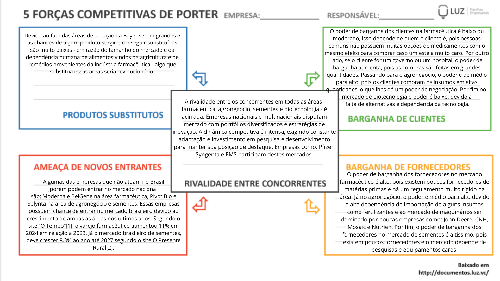
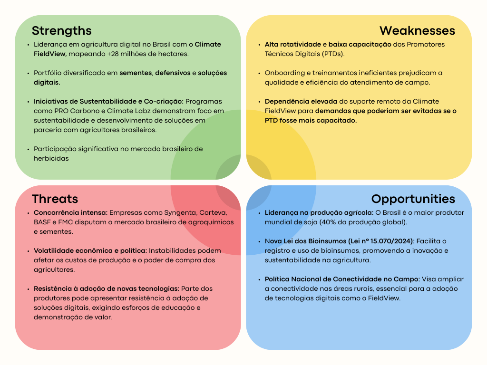
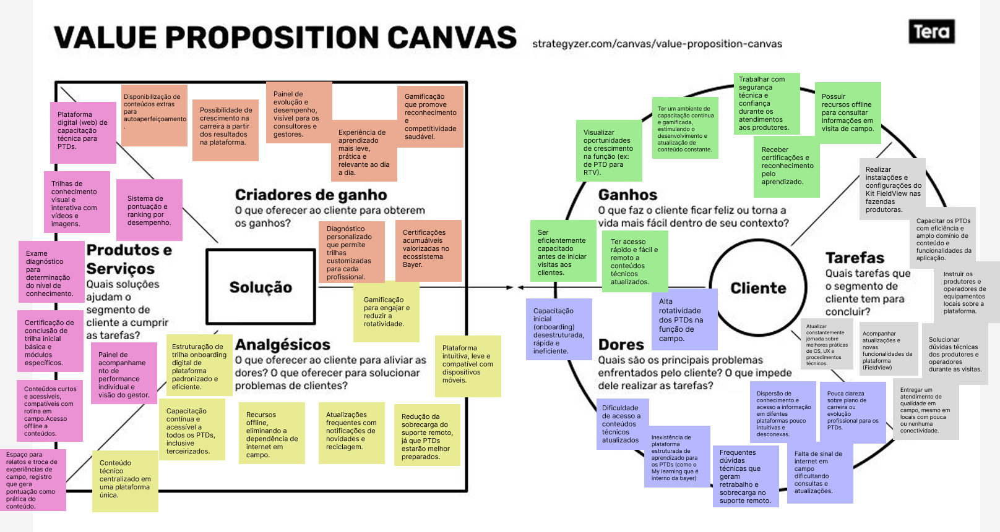
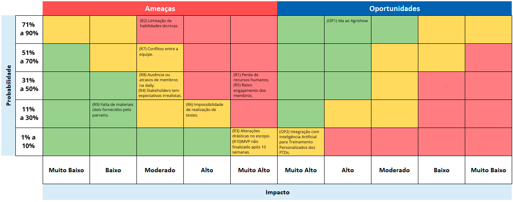
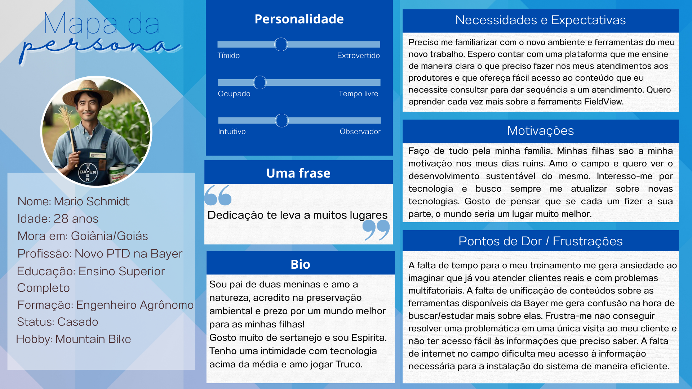
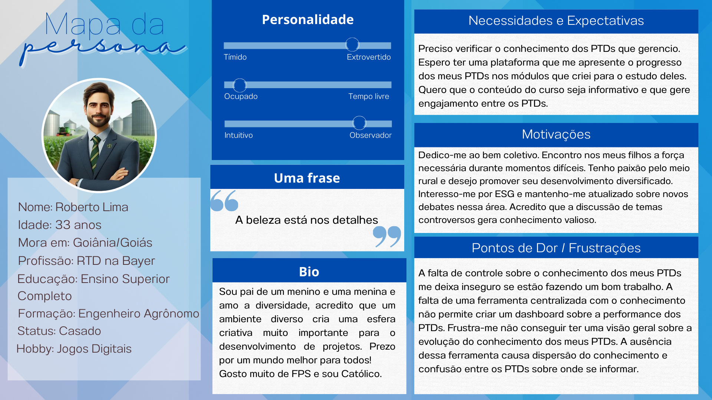
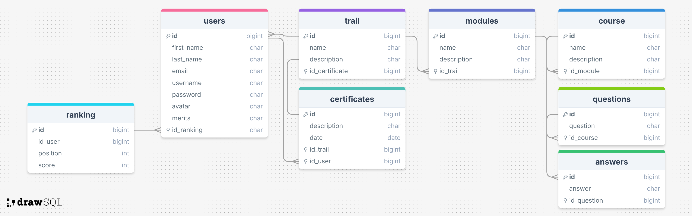

# WAD - Web Application Document - Módulo 2 - Inteli

**_Os trechos em itálico servem apenas como guia para o preenchimento da seção. Por esse motivo, não devem fazer parte da documentação final_**

## Nome do Grupo

#### Nomes dos integrantes do grupo

## Sumário

[1. Introdução](#c1)

[2. Visão Geral da Aplicação Web](#c2)

[3. Projeto Técnico da Aplicação Web](#c3)

[4. Desenvolvimento da Aplicação Web](#c4)

[5. Testes da Aplicação Web](#c5)

[6. Estudo de Mercado e Plano de Marketing](#c6)

[7. Conclusões e trabalhos futuros](#c7)

[8. Referências](c#8)

[Anexos](#c9)

 

# 1. Introdução (sprints 1 a 5)

A Bayer Crop Science, por meio de sua solução digital Climate FieldView, oferece tecnologias que permitem aos produtores monitorar, planejar e otimizar suas operações agrícolas. No entanto, a execução dessa proposta de valor depende diretamente de uma rede de Promotores Técnicos Digitais (PTDs), profissionais responsáveis pela instalação e configuração do Kit FieldView em campo, além do treinamento inicial dos clientes e atendimento.

Atualmente, o onboarding desses PTDs é rápido, desestruturado e, muitas vezes, ineficiente, resultando em atendimentos de baixa qualidade, insatisfação dos produtores e sobrecarga no suporte remoto. A alta rotatividade do time agrava essa situação, dificultando a padronização de procedimentos e a retenção de conhecimento técnico.

Para enfrentar esse cenário, foi proposta a criação de uma plataforma digital de capacitação técnica, acessível via web e mobile, com trilhas de conhecimento estruturadas, conteúdos multimídia e recursos de gamificação. A solução busca nivelar o conhecimento dos PTDs, oferecer treinamentos contínuos e disponibilizar conteúdos curtos e objetivos, compatíveis com as limitações de tempo e conectividade no campo.

Entre os aspectos essenciais para a criação de valor estão a centralização e organização de conteúdos técnicos, a possibilidade de diagnóstico individual de conhecimento, a certificação de profissionais antes de seu envio a campo e a oferta de recursos offline. Além disso, a plataforma permitirá à Bayer acompanhar a evolução dos colaboradores, identificar lacunas e alinhar os treinamentos às demandas regionais e de safra, otimizando o atendimento ao produtor e fortalecendo a experiência com o Climate FieldView.

# 2. Visão Geral da Aplicação Web (sprint 1)

## 2.1. Escopo do Projeto (sprints 1 e 4)

### 2.1.1. Modelo de 5 Forças de Porter (sprint 1)

  

template de Porter (1979), adaptado pelos autores (2025).

### 2.1.2. Análise SWOT da Instituição Parceira (sprint 1)

 Figura 2: Análise SWOT

  

 Canva: Circle Infographic Diagram SWOT Analysis (sem data), adaptada pelos autores (2025).  
Fontes da pesquisa em referências. 
   

### 2.1.3. Solução (sprints 1 a 5)

1. Problema a ser resolvido: alta rotatividade e falta de capacitação adequada dos Promotores Técnicos Digitais (PTDs) da Bayer, responsáveis pelo suporte do FieldView. Isso gera insatisfação nos produtores, sobrecarga no suporte remoto e PTDs despreparados em campo, impactando a adoção e o valor percebido da plataforma digital.
2. Dados disponíveis (mencionar fonte e conteúdo; se não houver, indicar “não se aplica”): não se aplica.
3. Solução proposta: desenvolvimento de uma plataforma web de capacitação para Promotores Técnicos Digitais. Incluirá avaliação de nivelamento, trilhas de conhecimento personalizadas com conteúdos multimídia, avaliações interativas, testes de certificação, sistema de busca rápida, elementos de gamificação (sistema de pontuação/ranking) e área administrativa para monitoramento e gestão de conteúdo.
4. Forma de utilização da solução: os Promotores Técnicos Digitais (PTDs) acessarão a plataforma para realizar testes, seguir trilhas de aprendizado, consultar materiais e acompanhar seu progresso. Administradores utilizarão a área restrita para monitorar o desempenho dos profissionais, gerenciar usuários, atribuir treinamentos e atualizar o conteúdo das trilhas e avaliações.
5. Benefícios esperados: certificação e melhor preparo dos Promotores Técnicos Digitais antes do campo, redução da rotatividade e da carga do suporte remoto, aumento da satisfação dos produtores, padronização do conhecimento técnico sobre o FieldView e otimização do processo de capacitação da equipe.
6. Critério de sucesso e como será avaliado: aumento na taxa de Promotores Técnicos Digitais (PTDs) certificados antes de ir a campo (>90%), redução no volume de chamados de suporte relacionados a dúvidas básicas (>20%), e alta taxa de engajamento/conclusão de trilhas na plataforma (>80%). Avaliado via relatórios da plataforma e pesquisas de satisfação com os profissionais e produtores.

### 2.1.4. Value Proposition Canvas (sprint 1):

O Canvas de Proposta de Valor é uma ferramenta visual que apoia a organização e validação de hipóteses sobre o perfil de clientes e o valor que uma solução oferece. Ele é dividido em duas áreas principais: o Perfil do Cliente (tarefas, dores e ganhos) e o Mapa de Valor (produtos/serviços, criadores de ganho e aliviadores de dor). Essa estrutura facilita o alinhamento entre as necessidades do cliente e as soluções propostas, aumentando as chances de sucesso no desenvolvimento de produtos e serviços.

  

Para este projeto, foi desenvolvido um Canvas de Proposta de Valor visando mapear as necessidades, dores e expectativas dos PTDs (Profissionais Técnicos de Desenvolvimento) do Climate FieldView da Bayer no eixo de Crop Science. Eles atuam em campo, e alinham essas informações às soluções propostas pela plataforma digital de capacitação técnica. O objetivo é oferecer um ambiente acessível, atualizado e motivador, reduzindo a rotatividade e aumentando a eficiência no atendimento técnico aos produtores.

No canvas, as tarefas dos clientes foram identificadas, assim como suas principais dores — como dificuldade de acesso a conteúdos técnicos atualizados, suporte remoto sobrecarregado e alta rotatividade — e os ganhos desejados, como certificações, crescimento na função e segurança técnica durante os atendimentos. Em resposta, a solução propõe trilhas de capacitação personalizadas, conteúdos acessíveis offline, gamificação para engajamento e painéis de desempenho para gestores.

Esse material serviu como base para estruturar as funcionalidades e o roadmap da solução, garantindo aderência às reais demandas do público-alvo.

FERREIRA, Kellison. Canvas de Proposta de Valor: o que é, como fazer e template gratuito. Somos Tera, 2023. Disponível em: https://blog.somostera.com/product-management/canvas-de-proposta-de-valor. Acesso em: 23 abril 2025.

### 2.1.5. Matriz de Riscos do Projeto (sprint 1)

&nbsp; &nbsp; &nbsp; &nbsp;A matriz de risco é uma ferramenta que favorece a identificação e a análise de possíveis adversidades com potencial de afetar o desenvolvimento e a entrega do projeto, assim como de oportunidades viáveis que podem elevar o escopo do projeto a uma esfera maior. Para isso, haja vista que risco = impacto \* probabilidade, a matriz quantifica e classifica os riscos e oportunidades por intermédio de uma tabela orientada por colunas que representam os impactos e por linhas que configuram as probabilidades, em porcentagem de ocorrência. Assim, é possível dimensionar e catalogar os riscos e oportunidades, tornando-os mais transparentes e, portanto, mais tangíveis para elaborar um plano de ação, garantindo que os esforços e os recursos da equipe sejam estrategicamente e adequadamente alocados.

&nbsp; &nbsp; &nbsp; &nbsp;Sob essa ótica, seguem listados os riscos - bem como o plano de ação correspondente para mitigá-los - e as oportunidades identificadas pela equipe, ressaltando como se enquadram na matriz.

**Riscos do projeto:**

1. **Perda de recursos humanos:** entende-se como perda de recursos humanos a indisponibilidade absoluta de qualquer membro da equipe no projeto, por motivos de saúde ou de imprevistos pessoais.

   **Impacto:** Muito alto, pois, sob as lentes da execução das tarefas do projeto, é perceptível que o afastamento completo de um ou mais membros gera, não só a diminuição da produtividade da equipe, mas também a sobrecarga de trabalho nos membros ainda presentes. Paralelamente, percebe-se que, em relação à geração de ideias, a deficiência de um membro reflete também na diminuição da criatividade no projeto, pois a situação limita a variação de raciocínios e de perspectivas no projeto.

   **Probabilidade:** 50%, haja vista que não é possível atribuir certeza em relação a acontecimentos e imprevistos extremos na vida pessoal de cada membro.

   **Plano de ação:** manter uma organização e um planejamento flexível é imprescindível para lidar com o risco supracitado, pois, somente assim, a equipe estará preparada para se adaptar se um membro se ausentar, sem impactar significamente o cronograma do projeto.

2. **Limitação de habilidades técnicas:** Em razão da densidade e da complexidade do escopo, assim como da inexperiência da maioria dos membros da equipe, a limitação de habilidades técnicas configura-se como um risco válido de analisar. Nessa análise, compreende-se o obstáculo supracitado como a dificuldade dos membros de usar as linguagens e as ferramentas técnicas - de programação, design ou matemática - necessárias para o desenvolvimento da plataforma.

   **Impacto:** Moderado, pois, embora a falta de domínio técnico dos membros limitar as funcionalidades que o projeto poderia contemplar - já que, sem o conhecimento técnico não é possível implementá-las -, o risco não impossibilita a entrega do MVP, de modo que exige não mais que o aumento de horas de dedicação e de estudos para desenvolver o projeto.

   **Probabilidade:** 80%, já que as necessidades do parceiro e as ferramentas necessárias para mitigar o problema da capacitação insuficiente dos PTDs - como linguagens de programação e conceitos matemáticos - são complexas e exigem elevado conhecimento técnico.

   **Plano de Ação:** É imprescindível que, para conter o risco supracitado, a equipe deve ceder esforços e tempo para estudar os conteúdos técnicos que serão usados no desenvolvimento do projeto, de forma a buscar apoio em livros e pesquisas na internet, assim como dos materiais disponibilizados pela faculdade. Além disso, é valoroso solicitar o auxílio dos professores e monitores das áreas técnicas que a equipe apresentar dificuldades.

3. **Alterações drásticas no escopo do projeto:** o risco diz respeito a situações em que o parceiro queira modificar, drasticamente, as principais funcionalidades e objetivos do projeto, ou o surgimento de medidas legislativas inesperadas que prejudiquem a execução do escopo original do projeto.

   **Impacto:** Muito alto, uma vez que o projeto é baseado no Termo de Abertura do Projeto do Inteli (TAPI), o qual foi formulado, anteriormente ao início das Sprints, pela equipe da faculdade em conjunto com os stakeholders, de modo que a alteração extrema deste documento indica o retrabalho de todos os setores do projeto já desenvolvido, se não também dos próprios artefatos.

   **Probabilidade:** Cerca de 5%, haja vista que o parceiro demonstrou certeza e segurança sobre o escopo do projeto e reforçou, durante o kickoff, a necessidade do projeto para a empresa, de maneira que é possível concluir a baixa probabilidade de ocorrência do referido risco. Já no que tange a mudanças regulamentares, alterações extremas nesse campo são muito improváveis, considerando principalmente que a aprovação e aplicações legislativas demandam muito tempo para serem efetivadas.

   **Plano de Ação:** para prevenir esse risco, é essencial sempre manter a comunicação clara com o parceiro - especialmente nas Sprints Reviews - e validar as ideias de implementação do projeto, antes de, de fato, implementá-las.

4. **Stakeholders desenvolverem expectativas exacerbadas sobre o projeto:** há possibilidade do parceiro criar expectativas imprecisas quanto à plataforma, como desenvolver o fascínio por funcionalidades que não cabem na grade curricular da equipe no período das 5 sprints.

   **Impacto:** Moderado, pois, apesar de atrapalhar a visão do parceiro em relação ao projeto, o risco não impede o desenvolvimento e a entrega do MVP.

   **Probabilidade:** entre 31% a 50%, pois, embora o parceiro tenha parcialmente demonstrado compreensão sobre o momento acadêmico dos membros da equipe no kickoff, não é difícil que ele tenha ânsia por implementações adicionais que não estão de acordo com o nível técnico da equipe no período das 10 semanas de desenvolvimento..

   **Plano de Ação:** Com o fito de precaver a ameaça, urge que a equipe deixe claro ao parceiro exatamente o que é possível desenvolver e não prometa aplicações adicionais sem a certeza de que será possível implementá-las, considerando, sempre, as habilidades técnicas que serão desenvolvidas no módulo. Ademais, dar ênfase às expectativas do parceiro que serão possíveis executar.

5. **Baixo engajamento dos membros com o projeto:** Existe chance de, por excesso de atividades ou compromissos extracurriculares à grade curricular da faculdade, os membros da equipe desviarem sua atenção das suas responsabilidades no projeto.

   **Impacto:** Muito alto, visto que o não compromisso de um ou mais membros diminui a produtividade no projeto, sobrecarrega os membros engajados e aumenta a probabilidade dos artefatos não serem atendidos no prazo.

   **Probabilidade:** 31% a 50%, pois apesar do projeto dever ocupar um nível de prioridade na rotina dos membros, não é raro superestimar o quanto é possível responsabilizar-se em atividades extracurriculares que consomem tempo e esforço, o que resulta, dessa forma, no desprezo das tarefas do projeto.

   **Plano de Ação:** motivar os membros que não estão engajados e que encontram-se sobrecarregados com outras atividades a desenvolver uma rotina saudável que respeite suas obrigações dentro do projeto. Assim também, vale reforçar ao membro a importância do seu trabalho para o andamento de toda a equipe.

6. **Impossibilidade de realização de testes:** não conseguir realizar testes com potenciais usuários caracteriza um risco para o projeto, haja vista que, tanto nos testes de usabilidade, quanto nos testes de integração de endpoints automatizados, existe possibilidade da equipe não encontrar voluntários para testar a plataforma, ou de não haver tempo suficiente para a realização.

   **Impacto:** Alto, pois o risco impede a validação das funcionalidades do projeto e inibe a extração de feedbacks de potenciais usuários, impedindo também, consequentemente, a identificação de falhas na plataforma.

   **Probabilidade:** Entre 11% a 30%, pois os professores e o instrutor do Inteli se disponibilizam para auxiliar com os recursos necessários para a realização dos testes. Entretanto, há ainda a possibilidade de acontecer impedimentos, como não entregar um protótipo testável à tempo.

   **Plano de Ação:** planejar a execução dos testes com antecedência, priorizar a produção do projeto de modo que ele seja testável dentro do prazo estabelecido e alocar esforços para o encontro de voluntários.

7. **Conflitos entre a equipe:** compreende-se como conflitos entre a equipe quaisquer desacordos ou desentendimentos entre os membros, como opiniões divergentes e mal entendidos.

   **Impacto:** Moderado, uma vez que depende do grau da discordância. No entanto, é importante salientar que, em casos extremos, o desempenho e a convivência da equipe podem ser drasticamente afetados.

   **Probabilidade:** Em torno de 51% a 70%, haja vista que a equipe é feita de indivíduos diversos e, por isso, não é raro haver pontos de vista divergentes.

   **Plano de ação:** Com a finalidade de mitigar esse risco, cada membro tem a incumbência de, durante os fechamentos que ocorrem ao final do período de desenvolvimento do projeto, atualizar a equipe sobre o seu progresso no dia, assim como sinalizar no Whatsapp e no Slack quando terminar sua atividade. Dessa forma, é possível evitar intrigas por falha de comunicação.

8. **Ausência ou atrasos de membros na daily:** Pode acontecer dos membros subestimarem a importância do momento da daily e não arcarem com a devida responsabilidade de comparecer no horário combinado. Assim também, a demora ou ausência na daily pode ocorrer em função das demais responsabilidades dos membros em atividades extracurriculares.

   **Impacto:** Moderado, pois apesar da falta de um ou mais membros na daily deixar o membro ausente desatualizado do kanban, o atraso não interfere com grande impacto no desenvolvimento das tarefas, já que o membro pode ser posteriormente atualizado, impactando, assim, moderadamente o projeto.

   **Probabilidade:** 31% a 50%, pois não é raro acontecer de um membro se perder em seus horários e atrasar para chegar na daily.

   **Plano de ação:** 5 minutos antes da daily, como forma de mitigar a problemática, é válido o ScrumMaster ou os outros membros mandarem mensagem no grupo de Whatsapp e no Slack solicitando que todos os membros retornem para a sala e, se necessário, marcando também os membros que ainda não estiverem no local. Ademais, comunicar os membros que estiverem atrasando ou se ausentando da daily sobre a importância desse momento para o desenvolvimento do projeto e sugerir formas de ajudar a lembrá-lo de chegar no horário, como colocar um despertador.

9. **Falta de materiais úteis fornecidos pelo parceiro:** Pode acontecer do parceiro esquecer de enviar materiais úteis para o desenvolvimento de alguma parte do projeto, como arquivos relacionados ao negócio ou informações dos requisitos.

   **Impacto:** Baixo, pois apesar de, em alguns casos, ter o potencial de tornar o desenvolvimento menos preciso, a faculdade já dispõe das informações e dos materiais que são, de fato, imprescindíveis para o projeto.

   **Probabilidade:** de 11% a 30%, pois já no kickoff o parceiro se responsabilizou por enviar os materiais de negócios e de design que são necessários para o desenvolvimento do projeto.

   **Plano de ação:** Comunicar o orientador para que, se necessário, cobre o parceiro para enviar os materiais que estejam faltando.

10. **MVP não finalizado após 10 semanas:** Existe a possibilidade de, por consequência da não intervenção para mitigar os possíveis riscos, por motivos de atrasos, ou imprevistos na equipe, o projeto não ser finalizado em sua completude até a quinta sprint.

    **Impacto:** Muito Alto, pois a entrega do MVP é o principal foco do projeto.

    **Probabilidade:** 1% a 10%, pois mesmo que não seja possível entregar o projeto de modo a atingir todas as expectativas e com todos os adicionais, a equipe dispõe de apoio suficiente da faculdade para que a entrega do MVP seja provável de ser cumprida dentro do prazo de 10 semanas.

    **Plano de ação:** Organizar as atividades derivadas das User Stories nas sprints, de forma que seja possível entregá-las com, ao menos, uma pequena margem de antecedência. Assim também, vale o Scrum Master garantir que todos os membros estejam, de fato, trabalhando em suas tarefas e não atrasando o andamento do projeto.

**Oportunidades do projeto:**

1. **Ida ao Agrishow:** por intermédio de pesquisas e do contato com profissionais da área, identificamos a oportunidade de alguns membros da equipe estarem presentes no Agrishow - maior evento de agrotecnologia do Brasil - no qual grandes empresas do setor de agronegócios comparecem para compartilhar conhecimentos, realizar pesquisas de campo e ganhar repertório. Neste evento, a equipe enxerga a oportunidade de entender com precisão o negócio do parceiro e, assim, desenvolver um projeto mais coerente com as suas necessidades.

   **Impacto:** Alto, pois o melhor entendimento do negócio reflete um projeto superior que mais agrada o parceiro.

   **Probabilidade:** de 70% a 90%, haja vista que a faculdade já dispõe de alguns convites para que alguns membros da equipe compareça no evento.

2. **Integração com Inteligência Artificial para Treinamento Personalizados dos PTDs:** existe a possibilidade de, no futuro, caso o projeto seja continuado, haver a integração de Inteligência Artificial na plataforma, a qual permita a sugestão de conteúdos específicos para cada PTD - baseado no seu desempenho individual - aumentando, assim, a eficiência do treinamento.

   **Impacto:** Muito alto, pois a personalização eleva o escopo do projeto, de modo a aumentar a eficiência do treinamento dos PTDs e de potencializar a experiência do usuário.

   **Probabilidade:** de 1% a 10%, pois as habilidades técnicas que tangem à integração com Inteligência Artificial não são contempladas na grade curricular da equipe no período de desenvolvimento desse projeto.

Figura 1: Matriz de risco

  

Tabela de Napoleão (2020), adaptada pelos autores (2025).
   

## 2.2. Personas (sprint 1)

_Posicione aqui suas Personas em forma de texto markdown com imagens, ou como imagem de template preenchido. Atualize esta seção ao longo do módulo se necessário._

Persona PTD:

  

Persona RTD:

  

## 2.3. User Stories (sprints 1 a 5)

O levantamento de User Stories é uma prática essencial na gestão ágil de projetos, pois permite representar de forma objetiva as necessidades e expectativas dos usuários e stakeholders. As User Stories (US) são formuladas com base em perfis reais dos envolvidos no sistema, facilitando o alinhamento entre o time de desenvolvimento e os objetivos do projeto. Este documento apresenta a lista completa de User Stories levantadas para o projeto, organizadas de acordo com a estrutura padrão “Como [persona], posso [ação/meta], para [benefício/razão]”. Todas foram numeradas com a referência USXX, a ser utilizada também no roadmap do quadro Kanban. Dentre elas, cinco foram priorizadas com base em critérios de valor, dependência e viabilidade, e seus aspectos INVEST estão detalhados a seguir.

### US01 — Entendimento do Parceiro

| Identificação       | US01                                                                                                           |
|---------------------|-----------------------------------------------------------------------------------------------------------------|
| Persona             | Desenvolvedor                                                                                                   |
| User Story          | Enquanto membro do Grupo 4, gostaria de entender de forma concreta quem é o parceiro e o que ele faz, para que o desenvolvimento da solução atenda de forma eficaz às demandas do projeto. |
| Critério de aceite 1| Deve-se registrar um resumo do perfil e da atuação da instituição parceira.                                    |
| Critério de aceite 2| As informações precisam ser claras e de fácil acesso para todos do grupo.                                       |
| Critérios INVEST    | _ **Independente**: Pode ser realizada separadamente das demais funcionalidades.                               |
|                     | _ **Negociável**: O formato do entendimento pode ser adaptado (pesquisas, reuniões, entrevistas).              |
|                     | _ **Valoroso**: Traz clareza e propósito ao projeto, otimizando esforços.                                      |
|                     | _ **Estimável**: Estimável em horas de levantamento e análise de dados.                                        |
|                     | _ **Small**: A atividade pode ser concluída rapidamente.                                                       |
|                     | _ **Testável**: Será validada pela existência de documentação clara.                                           |

---

### US02 — Compreensão da Plataforma FieldView

| Identificação       | US02                                                                                                           |
|---------------------|-----------------------------------------------------------------------------------------------------------------|
| Persona             | Desenvolvedor                                                                                                   |
| User Story          | Enquanto membro do Grupo 4, gostaria de entender o produto e a plataforma FieldView de forma plena, a fim de desenvolver corretamente as funcionalidades, o escopo e os parâmetros do projeto. |
| Critério de aceite 1| Deve ser criada documentação das funcionalidades principais do FieldView.                                       |
| Critério de aceite 2| As dúvidas devem ser esclarecidas junto ao parceiro ou orientador.                                             |
| Critérios INVEST    | _ **Independente**: Pode ser concluída antes da implementação técnica.                                         |
|                     | _ **Negociável**: O nível de profundidade pode ser ajustado conforme a necessidade do projeto.                 |
|                     | _ **Valoroso**: Garante uma base sólida para o desenvolvimento.                                                |
|                     | _ **Estimável**: Carga horária mensurável para pesquisa e registro.                                            |
|                     | _ **Small**: Pode ser feita em etapas pequenas.                                                                |
|                     | _ **Testável**: Verificável por meio da entrega da documentação.                                               |

---

### US03 — Documentação dos Requisitos

| Identificação       | US03                                                                                                           |
|---------------------|-----------------------------------------------------------------------------------------------------------------|
| Persona             | Desenvolvedor                                                                                                   |
| User Story          | Como Grupo 4, deseja-se que os requisitos do projeto sejam documentados de forma organizada, integrando todos os membros e centralizando as informações de desenvolvimento. |
| Critério de aceite 1| Criação de um documento compartilhado contendo todos os requisitos.                                             |
| Critério de aceite 2| Atualizações devem ser registradas com histórico de mudanças.                                                  |
| Critérios INVEST    | _ **Independente**: Pode ser feito em paralelo às demais tarefas.                                              |
|                     | _ **Negociável**: O formato da documentação pode ser adaptado.                                                 |
|                     | _ **Valoroso**: Facilita o alinhamento de todos os membros.                                                    |
|                     | _ **Estimável**: Pode-se estimar com base no número de requisitos.                                             |
|                     | _ **Small**: Divisível em categorias (ex.: requisitos técnicos, funcionais).                                   |
|                     | _ **Testável**: Verificável pela existência e atualização do documento.                                        |

---

### US04 — Definição Realista das Funcionalidades

| Identificação       | US04                                                                                                           |
|---------------------|-----------------------------------------------------------------------------------------------------------------|
| Persona             | Desenvolvedor                                                                                                   |
| User Story          | Como integrantes do Grupo 4, responsáveis pelo desenvolvimento da aplicação, reconhece-se que é de interesse mútuo que as funcionalidades do site sejam planejadas e definidas de forma realista, considerando as necessidades dos usuários finais (PTDs) e as possibilidades técnicas dos desenvolvedores. |
| Critério de aceite 1| Elaboração de uma lista priorizada de funcionalidades.                                                         |
| Critério de aceite 2| Validação da lista em conjunto com os membros do grupo e o orientador.                                         |
| Critérios INVEST    | _ **Independente**: Pode ser desenvolvida antes da codificação.                                                |
|                     | _ **Negociável**: As funcionalidades podem ser adaptadas conforme feedback.                                    |
|                     | _ **Valoroso**: Evita desperdício de recursos.                                                                 |
|                     | _ **Estimável**: Definível em termos de funcionalidades entregáveis.                                           |
|                     | _ **Small**: Cada funcionalidade pode ser descrita de forma sucinta.                                           |
|                     | _ **Testável**: Confirmada pela lista aprovada.                                                                |

---

### US05 — Design Acessível e Centrado no Usuário

| Identificação       | US05                                                                                                           |
|---------------------|-----------------------------------------------------------------------------------------------------------------|
| Persona             | Desenvolvedor                                                                                                   |
| User Story          | Como desenvolvedores da solução, deseja-se priorizar o público-alvo (PTDs) com um design acessível e centrado no usuário, visando atender melhor às suas necessidades. |
| Critério de aceite 1| Definição de diretrizes de acessibilidade para o projeto.                                                       |
| Critério de aceite 2| Realização de teste de usabilidade com foco em acessibilidade.                                                  |
| Critério de aceite 3| Utilizar como base as personas criadas para definir o projeto, como forma de verificação.                       |
| Critérios INVEST    | _ **Independente**: Não depende de outra funcionalidade.                                                       |
|                     | _ **Negociável**: O nível de adaptação pode ser ajustado.                                                      |
|                     | _ **Valoroso**: Garante inclusão e melhoria na experiência do usuário.                                         |
|                     | _ **Estimável**: Pode ser planejado em etapas.                                                                 |
|                     | _ **Small**: Divisível em entregas menores (padrões, exemplos de telas).                                       |
|                     | _ **Testável**: Avaliado por meio de testes de usabilidade.                                                    |

---

### US06 —  Implementação do Banco de Dados

Identificação | US06
--- | ---
Persona | Desenvolvedor
User Story | Como integrante do Grupo 4, posso implementar o banco de dados, para armazenar todas as informações necessárias para o funcionamento do sistema.
Critério de aceite 1 | Devem ser criadas todas as tabelas conforme o modelo relacional definido.
Critério de aceite 2 | Os relacionamentos entre as tabelas devem ser corretamente implementados.
Critério de aceite 3 | Devem ser desenvolvidos scripts de migração para os ambientes de desenvolvimento e produção.
Critério de aceite 4 | As queries para as principais operações devem ser otimizadas quanto à performance.

---

### US07 —  Implementação do Sistema de Trilhas de Conhecimento

Identificação | US07
--- | ---
Persona | PTD
User Story | Como PTD, posso utilizar o sistema de trilhas de conhecimento, para organizar e acessar materiais de estudo.
Critério de aceite 1 | Deve ser possível criar e editar trilhas de conhecimento.
Critério de aceite 2 | Os conteúdos devem ser organizados em módulos dentro das trilhas.
Critério de aceite 3 | O sistema deve controlar o progresso do usuário em cada trilha.
Critério de aceite 4 | O usuário deve poder visualizar as trilhas disponíveis e aquelas que já foram concluídas.

---

### US08 —  Implementação do Sistema de Avaliação

Identificação | US08
--- | ---
Persona | Consultor
User Story | Como consultor, posso contar com o sistema de avaliação, para verificar o conhecimento dos usuários e emitir certificados.
Critério de aceite 1 | O sistema deve permitir a criação e edição de avaliações com diferentes tipos de questões (múltipla escolha, dissertativa etc.).
Critério de aceite 2 | As avaliações devem ter tempo controlado para realização.
Critério de aceite 3 | Deve ser possível gerar certificados para os usuários aprovados nas avaliações.

---

### US09 —  Implementação do Sistema de Autenticação

Identificação | US09
--- | ---
Persona | Consultor
User Story | Como consultor, posso contar com um sistema de autenticação, para controlar o acesso à plataforma conforme os perfis de usuários.
Critério de aceite 1 | Deve ser possível realizar o cadastro de novos usuários com validação adequada dos dados inseridos.
Critério de aceite 2 | Devem ser implementados diferentes níveis de acesso (PTD, administrador e gestor).

---

### US10 —   Implementação do Sistema de Gamificação

Identificação | US10
--- | ---
Persona | PTD
User Story | Como PTD, posso acessar um sistema de ensino gamificado, para tornar o aprendizado mais intuitivo e eficiente.
Critério de aceite 1 | O sistema deve incluir atividades interativas que estimulem a participação contínua e o aprofundamento no conteúdo.
Critério de aceite 2 | O sistema deve fornecer feedback em tempo real sobre o desempenho do usuário.

---

### US11 —  Criação de Wireframes para Validação do Fluxo

Identificação | US11
--- | ---
Persona | Desenvolvedor
User Story | Como Grupo 4, posso criar wireframes para todas as telas principais, para validar o fluxo de navegação antes da implementação.
Critério de aceite 1 | Devem ser desenvolvidos wireframes para todas as telas principais do sistema.
Critério de aceite 2 | Os elementos de interface devem ser representados de forma clara e organizada.
Critério de aceite 3 | O fluxo de navegação entre as telas deve ser indicado e compreensível.
Critério de aceite 4 | Os wireframes devem ser estruturados utlizando um sistema de grid consistente.

---

### US12 —  Criação de Protótipos de Alta Fidelidade

Identificação | US12
--- | ---
Persona | Desenvolvedor
User Story | Como integrante do Grupo 4, posso criar protótipos de alta fidelidade, para visualizar o produto final e validar a proposta junto aos parceiros.
Critério de aceite 1 | Devem ser desenvolvidos protótipos de alta fidelidade para todas as telas principais do sistema.
Critério de aceite 2 | O guia de estilos deve ser aplicado corretamente em todos os protótipos.
Critério de aceite 3 | Devem ser implementadas interações básicas demonstrando o fluxo de navegação do usuário.
Critério de aceite 4 | CR4: Os protótipos devem ser adaptados para diferentes dispositivos (responsividade).

O conjunto de User Stories descrito acima reflete a complexidade e os objetivos do projeto, ao mesmo tempo em que segue os princípios da metodologia ágil. A priorização das cinco primeiras histórias garante um foco inicial na compreensão do problema, do contexto da plataforma, e no alinhamento das funcionalidades e design com os usuários finais. A documentação organizada em formato USXX contribui para o planejamento visual no quadro Kanban, além de facilitar a rastreabilidade e o acompanhamento da execução. Mesmo as histórias que não forem implementadas imediatamente permanecem registradas para referência futura, assegurando a continuidade e consistência do desenvolvimento do produto.

# 3. Projeto da Aplicação Web (sprints 1 a 4)

## 3.1. Arquitetura (sprints 3 e 4)

_Posicione aqui o diagrama de arquitetura da sua solução de aplicação web. Atualize sempre que necessário_

## 3.2. Wireframes (sprint 2)

_Posicione aqui as imagens do wireframe construído para sua solução e, opcionalmente, o link para acesso (mantenha o link sempre público para visualização)_

## 3.3. Guia de estilos (sprint 3)

_Descreva aqui orientações gerais para o leitor sobre como utilizar os componentes do guia de estilos de sua solução_

### 3.3.1 Cores

_Apresente aqui a paleta de cores, com seus códigos de aplicação e suas respectivas funções_

### 3.3.2 Tipografia

_Apresente aqui a tipografia da solução, com famílias de fontes e suas respectivas funções_

### 3.3.3 Iconografia e imagens

_(esta subseção é opcional, caso não existam ícones e imagens, apague esta subseção)_

_posicione aqui imagens e textos contendo exemplos padronizados de ícones e imagens, com seus respectivos atributos de aplicação, utilizadas na solução_

## 3.4 Protótipo de alta fidelidade (sprint 3)

_posicione aqui algumas imagens demonstrativas de seu protótipo de alta fidelidade e o link para acesso ao protótipo completo (mantenha o link sempre público para visualização)_

## 3.5. Modelagem do banco de dados (sprints 2 e 4)

### 3.5.1. Modelo relacional (sprints 2 e 4)

  

Conteúdo feito pelos autores (2025).

### 3.5.2. Consultas SQL e lógica proposicional (sprint 2)

_posicione aqui uma lista de consultas SQL compostas, realizadas pelo back-end da aplicação web, com sua respectiva lógica proposicional, descrita conforme template abaixo. Lembre-se que para usar LaTeX em markdown, basta você colocar as expressões entre $ ou $$_

_Template de SQL + lógica proposicional_
#1 | ---
--- | ---
**Expressão SQL** | SELECT \* FROM suppliers WHERE (state = 'California' AND supplier_id <> 900) OR (supplier_id = 100);
**Proposições lógicas** | $A$: O estado é 'California' (state = 'California')   $B$: O ID do fornecedor não é 900 (supplier_id ≠ 900)   $C$: O ID do fornecedor é 100 (supplier_id = 100)
**Expressão lógica proposicional** | $(A \land B) \lor C$
**Tabela Verdade** | <table> <thead> <tr> <th>$A$</th> <th>$B$</th> <th>$C$</th> <th>$(A \land B)$</th> <th>$(A \land B) \lor C$</th> </tr> </thead> <tbody> <tr> <td>F</td> <td>F</td> <td>F</td> <td>F</td> <td>F</td> </tr> <tr> <td>F</td> <td>F</td> <td>V</td> <td>F</td> <td>V</td> </tr> <tr> <td>F</td> <td>V</td> <td>F</td> <td>F</td> <td>F</td> </tr> <tr> <td>F</td> <td>V</td> <td>V</td> <td>F</td> <td>V</td> </tr> <tr> <td>V</td> <td>F</td> <td>F</td> <td>F</td> <td>F</td> </tr> <tr> <td>V</td> <td>F</td> <td>V</td> <td>F</td> <td>V</td> </tr> <tr> <td>V</td> <td>V</td> <td>F</td> <td>V</td> <td>V</td> </tr> <tr> <td>V</td> <td>V</td> <td>V</td> <td>V</td> <td>V</td> </tr> </tbody> </table>

_Dica: edite a tabela verdade fora do markdown, para ter melhor controle_

## 3.6. WebAPI e endpoints (sprints 3 e 4)

_Utilize um link para outra página de documentação contendo a descrição completa de cada endpoint. Ou descreva aqui cada endpoint criado para seu sistema._

_Cada endpoint deve conter endereço, método (GET, POST, PUT, PATCH, DELETE), header, body e formatos de response_

# 4. Desenvolvimento da Aplicação Web

## 4.1. Primeira versão da aplicação web (sprint 3)

_Descreva e ilustre aqui o desenvolvimento da sua primeira versão do sistema web, explicando brevemente o que foi entregue em termos de código e sistema. Utilize prints de tela para ilustrar. Indique as eventuais dificuldades e próximos passos._

## 4.2. Segunda versão da aplicação web (sprint 4)

_Descreva e ilustre aqui o desenvolvimento da sua segunda versão do sistema web, explicando brevemente o que foi entregue em termos de código e sistema. Utilize prints de tela para ilustrar. Indique as eventuais dificuldades e próximos passos._

## 4.3. Versão final da aplicação web (sprint 5)

_Descreva e ilustre aqui o desenvolvimento da última versão do sistema web, explicando brevemente o que foi entregue em termos de código e sistema. Utilize prints de tela para ilustrar. Indique as eventuais dificuldades e próximos passos._

# 5. Testes

## 5.1. Relatório de testes de integração de endpoints automatizados (sprint 4)

_Liste e descreva os testes unitários dos endpoints criados, automatizados e planejados para sua solução. Posicione aqui também o relatório de cobertura de testes Jest se houver (através de link ou transcrito para estrutura markdown)_

## 5.2. Testes de usabilidade (sprint 5)

_Posicione aqui as tabelas com enunciados de tarefas, etapas e resultados de testes de usabilidade. Ou utilize um link para seu relatório de testes (mantenha o link sempre público para visualização)_

# 6. Estudo de Mercado e Plano de Marketing (sprint 4)

## 6.1 Resumo Executivo

_Preencher com até 300 palavras, sem necessidade de fonte_

_Apresente de forma clara e objetiva os principais destaques do projeto: oportunidades de mercado, diferenciais competitivos da aplicação web e os objetivos estratégicos pretendidos._

## 6.2 Análise de Mercado

_a) Visão Geral do Setor (até 250 palavras)_
_Contextualize o setor no qual a aplicação está inserida, considerando aspectos econômicos, tecnológicos e regulatórios. Utilize fontes confiáveis._

_b) Tamanho e Crescimento do Mercado (até 250 palavras)_
_Apresente dados quantitativos sobre o tamanho atual e projeções de crescimento do mercado. Utilize fontes confiáveis._

_c) Tendências de Mercado (até 300 palavras)_
_Identifique e analise tendências relevantes (tecnológicas, comportamentais e mercadológicas) que influenciam o setor. Utilize fontes confiáveis._

## 6.3 Análise da Concorrência

_a) Principais Concorrentes (até 250 palavras)_
_Liste os concorrentes diretos e indiretos, destacando suas principais características e posicionamento no mercado._

_b) Vantagens Competitivas da Aplicação Web (até 250 palavras)_
_Descreva os diferenciais da sua aplicação em relação aos concorrentes, sem necessidade de citação de fontes._

## 6.4 Público-Alvo

_a) Segmentação de Mercado (até 250 palavras)_
Descreva os principais segmentos de mercado a serem atendidos pela aplicação. Utilize bases de dados e fontes confiáveis.\*

_b) Perfil do Público-Alvo (até 250 palavras)_
_Caracterize o público-alvo com dados demográficos, psicográficos e comportamentais, incluindo necessidades específicas. Utilize fontes obrigatórias._

## 6.5 Posicionamento

_a) Proposta de Valor Única (até 250 palavras)_
_Defina de maneira clara o que torna a sua aplicação única e valiosa para o mercado._

_b) Estratégia de Diferenciação (até 250 palavras)_
_Explique como sua aplicação se destacará da concorrência, evidenciando a lógica por trás do posicionamento._

## 6.6 Estratégia de Marketing

_a) Produto/Serviço (até 200 palavras)_
_Descreva as funcionalidades, benefícios e diferenciais da aplicação_

_6.2 Preço (até 200 palavras)_
_Explique o modelo de precificação adotado e justifique com base nas análises anteriores._

_6.3 Praça (Distribuição) (até 200 palavras)_
_Apresente os canais digitais utilizados para distribuir e entregar a aplicação ao público._

_6.4 Promoção (até 200 palavras)_
_Descreva as estratégias digitais planejadas, como SEO, redes sociais, marketing de conteúdo e campanhas pagas._

# 7. Conclusões e trabalhos futuros (sprint 5)

_Escreva de que formas a solução da aplicação web atingiu os objetivos descritos na seção 2 deste documento. Indique pontos fortes e pontos a melhorar de maneira geral._

_Relacione os pontos de melhorias evidenciados nos testes com planos de ações para serem implementadas. O grupo não precisa implementá-las, pode deixar registrado aqui o plano para ações futuras_

_Relacione também quaisquer outras ideias que o grupo tenha para melhorias futuras_

# 8. Referências (sprints 1 a 5)

_Incluir as principais referências de seu projeto, para que seu parceiro possa consultar caso ele se interessar em aprofundar. Um exemplo de referência de livro e de site:_ 

_LUCK, Heloisa. Liderança em gestão escolar. 4. ed. Petrópolis: Vozes, 2010.  _
_SOBRENOME, Nome. Título do livro: subtítulo do livro. Edição. Cidade de publicação: Nome da editora, Ano de publicação.  _

_INTELI. Adalove. Disponível em: https://adalove.inteli.edu.br/feed. Acesso em: 1 out. 2023  _
_SOBRENOME, Nome. Título do site. Disponível em: link do site. Acesso em: Dia Mês Ano_

## Gerais

1. CLIMATE FIELDVIEW. Plataforma de Agricultura Digital. Disponível em: https://climatefieldview.com.br/. Acesso em: 26 abr. 2025.​

## Pesquisa de mercado

1. MORDOR INTELLIGENCE. Brazil Crop Protection Pesticides Market. Disponível em: https://www.mordorintelligence.com/industry-reports/brazil-crop-protection-pesticides-market. Acesso em: 25 abr. 2025.​

2. KEN RESEARCH. Brazil Crop Protection Market. Disponível em: https://www.kenresearch.com/industry-reports/brazil-crop-protection-market. Acesso em: 25 abr. 2025.​

3. SPER RESEARCH. Brazil Crop Protection Market Growth, Size, Trends, Revenue, Challenges and Future Competition. Disponível em: https://www.sperresearch.com/report-store/brazil-crop-protection-market.aspx. Acesso em: 26 abr. 2025.​

4. AGROPAGES. Bayer's Digital Platform Reaches 22 Million Hectares Mapped in Brazil. Disponível em: https://news.agropages.com/News/NewsDetail---42177.htm. Acesso em: 27 abr. 2025.​

O Tempo Economia. Disponível em: https://www.otempo.com.br/economia/2025/3/6/setor-farmaceutico-cresce-11-e-movimenta-r-158-4-bilhoes-em-2024-mostra-levantamento. Acesso em: 26 abr. 2025
O Presente Rural. Disponível em: https://opresenterural.com.br/mercado-brasileiro-de-sementes-deve-crescer-83-ao-ano-ate-2027/. Acesso em: 26 abr. 2025

# Anexos

_Inclua aqui quaisquer complementos para seu projeto, como diagramas, imagens, tabelas etc. Organize em sub-tópicos utilizando headings menores (use ## ou ### para isso)_
