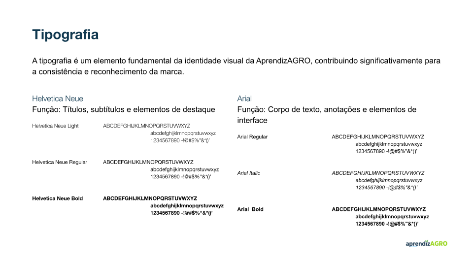

# WAD - Web Application Document - Módulo 2 - Inteli

**_Os trechos em itálico servem apenas como guia para o preenchimento da seção. Por esse motivo, não devem fazer parte da documentação final_**

## Nome do Grupo

#### Nomes dos integrantes do grupo

## Sumário

[1. Introdução](#c1)

[2. Visão Geral da Aplicação Web](#c2)

[3. Projeto Técnico da Aplicação Web](#c3)

[4. Desenvolvimento da Aplicação Web](#c4)

[5. Testes da Aplicação Web](#c5)

[6. Estudo de Mercado e Plano de Marketing](#c6)

[7. Conclusões e trabalhos futuros](#c7)

[8. Referências](c#8)

[Anexos](#c9)

 

# 1. Introdução (sprints 1 a 5)

A Bayer Crop Science, por meio de sua solução digital Climate FieldView, oferece tecnologias que permitem aos produtores monitorar, planejar e otimizar suas operações agrícolas. No entanto, a execução dessa proposta de valor depende diretamente de uma rede de Promotores Técnicos Digitais (PTDs), profissionais responsáveis pela instalação e configuração do Kit FieldView em campo, além do treinamento inicial dos clientes e atendimento.

Atualmente, o onboarding desses PTDs é rápido, desestruturado e, muitas vezes, ineficiente, resultando em atendimentos de baixa qualidade, insatisfação dos produtores e sobrecarga no suporte remoto. A alta rotatividade do time agrava essa situação, dificultando a padronização de procedimentos e a retenção de conhecimento técnico.

Para enfrentar esse cenário, foi proposta a criação de uma plataforma digital de capacitação técnica, acessível via web e mobile, com trilhas de conhecimento estruturadas, conteúdos multimídia e recursos de gamificação. A solução busca nivelar o conhecimento dos PTDs, oferecer treinamentos contínuos e disponibilizar conteúdos curtos e objetivos, compatíveis com as limitações de tempo e conectividade no campo.

Entre os aspectos essenciais para a criação de valor estão a centralização e organização de conteúdos técnicos, a possibilidade de diagnóstico individual de conhecimento, a certificação de profissionais antes de seu envio a campo e a oferta de recursos offline. Além disso, a plataforma permitirá à Bayer acompanhar a evolução dos colaboradores, identificar lacunas e alinhar os treinamentos às demandas regionais e de safra, otimizando o atendimento ao produtor e fortalecendo a experiência com o Climate FieldView.

# 2. Visão Geral da Aplicação Web (sprint 1)

## 2.1. Escopo do Projeto (sprints 1 e 4)

### 2.1.1. Modelo de 5 Forças de Porter (sprint 1)

  

template de Porter (1979), adaptado pelos autores (2025).

### 2.1.2. Análise SWOT da Instituição Parceira (sprint 1)

 Figura 2: Análise SWOT

  

 Canva: Circle Infographic Diagram SWOT Analysis (sem data), adaptada pelos autores (2025).  
Fontes da pesquisa em referências. 
   

### 2.1.3. Solução (sprints 1 a 5)

1. Problema a ser resolvido: alta rotatividade e falta de capacitação adequada dos Promotores Técnicos Digitais (PTDs) da Bayer, responsáveis pelo suporte do FieldView. Isso gera insatisfação nos produtores, sobrecarga no suporte remoto e PTDs despreparados em campo, impactando a adoção e o valor percebido da plataforma digital.
2. Dados disponíveis (mencionar fonte e conteúdo; se não houver, indicar “não se aplica”): não se aplica.
3. Solução proposta: desenvolvimento de uma plataforma web de capacitação para Promotores Técnicos Digitais. Incluirá avaliação de nivelamento, trilhas de conhecimento personalizadas com conteúdos multimídia, avaliações interativas, testes de certificação, sistema de busca rápida, elementos de gamificação (sistema de pontuação/ranking) e área administrativa para monitoramento e gestão de conteúdo.
4. Forma de utilização da solução: os Promotores Técnicos Digitais (PTDs) acessarão a plataforma para realizar testes, seguir trilhas de aprendizado, consultar materiais e acompanhar seu progresso. Administradores utilizarão a área restrita para monitorar o desempenho dos profissionais, gerenciar usuários, atribuir treinamentos e atualizar o conteúdo das trilhas e avaliações.
5. Benefícios esperados: certificação e melhor preparo dos Promotores Técnicos Digitais antes do campo, redução da rotatividade e da carga do suporte remoto, aumento da satisfação dos produtores, padronização do conhecimento técnico sobre o FieldView e otimização do processo de capacitação da equipe.
6. Critério de sucesso e como será avaliado: aumento na taxa de Promotores Técnicos Digitais (PTDs) certificados antes de ir a campo (>90%), redução no volume de chamados de suporte relacionados a dúvidas básicas (>20%), e alta taxa de engajamento/conclusão de trilhas na plataforma (>80%). Avaliado via relatórios da plataforma e pesquisas de satisfação com os profissionais e produtores.

### 2.1.4. Value Proposition Canvas (sprint 1):

O Canvas de Proposta de Valor é uma ferramenta visual que apoia a organização e validação de hipóteses sobre o perfil de clientes e o valor que uma solução oferece. Ele é dividido em duas áreas principais: o Perfil do Cliente (tarefas, dores e ganhos) e o Mapa de Valor (produtos/serviços, criadores de ganho e aliviadores de dor). Essa estrutura facilita o alinhamento entre as necessidades do cliente e as soluções propostas, aumentando as chances de sucesso no desenvolvimento de produtos e serviços.

  

Para este projeto, foi desenvolvido um Canvas de Proposta de Valor visando mapear as necessidades, dores e expectativas dos PTDs (Profissionais Técnicos de Desenvolvimento) do Climate FieldView da Bayer no eixo de Crop Science. Eles atuam em campo, e alinham essas informações às soluções propostas pela plataforma digital de capacitação técnica. O objetivo é oferecer um ambiente acessível, atualizado e motivador, reduzindo a rotatividade e aumentando a eficiência no atendimento técnico aos produtores.

No canvas, as tarefas dos clientes foram identificadas, assim como suas principais dores — como dificuldade de acesso a conteúdos técnicos atualizados, suporte remoto sobrecarregado e alta rotatividade — e os ganhos desejados, como certificações, crescimento na função e segurança técnica durante os atendimentos. Em resposta, a solução propõe trilhas de capacitação personalizadas, conteúdos acessíveis offline, gamificação para engajamento e painéis de desempenho para gestores.

Esse material serviu como base para estruturar as funcionalidades e o roadmap da solução, garantindo aderência às reais demandas do público-alvo.

FERREIRA, Kellison. Canvas de Proposta de Valor: o que é, como fazer e template gratuito. Somos Tera, 2023. Disponível em: https://blog.somostera.com/product-management/canvas-de-proposta-de-valor. Acesso em: 23 abril 2025.

### 2.1.5. Matriz de Riscos do Projeto (sprint 1)

&nbsp; &nbsp; &nbsp; &nbsp;A matriz de risco é uma ferramenta que favorece a identificação e a análise de possíveis adversidades com potencial de afetar o desenvolvimento e a entrega do projeto, assim como de oportunidades viáveis que podem elevar o escopo do projeto a uma esfera maior. Para isso, haja vista que risco = impacto \* probabilidade, a matriz quantifica e classifica os riscos e oportunidades por intermédio de uma tabela orientada por colunas que representam os impactos e por linhas que configuram as probabilidades, em porcentagem de ocorrência. Assim, é possível dimensionar e catalogar os riscos e oportunidades, tornando-os mais transparentes e, portanto, mais tangíveis para elaborar um plano de ação, garantindo que os esforços e os recursos da equipe sejam estrategicamente e adequadamente alocados.

&nbsp; &nbsp; &nbsp; &nbsp;Sob essa ótica, seguem listados os riscos - bem como o plano de ação correspondente para mitigá-los - e as oportunidades identificadas pela equipe, ressaltando como se enquadram na matriz.

**Riscos do projeto:**

1. **Perda de recursos humanos:** entende-se como perda de recursos humanos a indisponibilidade absoluta de qualquer membro da equipe no projeto, por motivos de saúde ou de imprevistos pessoais.

   **Impacto:** Muito alto, pois, sob as lentes da execução das tarefas do projeto, é perceptível que o afastamento completo de um ou mais membros gera, não só a diminuição da produtividade da equipe, mas também a sobrecarga de trabalho nos membros ainda presentes. Paralelamente, percebe-se que, em relação à geração de ideias, a deficiência de um membro reflete também na diminuição da criatividade no projeto, pois a situação limita a variação de raciocínios e de perspectivas no projeto.

   **Probabilidade:** 50%, haja vista que não é possível atribuir certeza em relação a acontecimentos e imprevistos extremos na vida pessoal de cada membro.

   **Plano de ação:** manter uma organização e um planejamento flexível é imprescindível para lidar com o risco supracitado, pois, somente assim, a equipe estará preparada para se adaptar se um membro se ausentar, sem impactar significamente o cronograma do projeto.

2. **Limitação de habilidades técnicas:** Em razão da densidade e da complexidade do escopo, assim como da inexperiência da maioria dos membros da equipe, a limitação de habilidades técnicas configura-se como um risco válido de analisar. Nessa análise, compreende-se o obstáculo supracitado como a dificuldade dos membros de usar as linguagens e as ferramentas técnicas - de programação, design ou matemática - necessárias para o desenvolvimento da plataforma.

   **Impacto:** Moderado, pois, embora a falta de domínio técnico dos membros limitar as funcionalidades que o projeto poderia contemplar - já que, sem o conhecimento técnico não é possível implementá-las -, o risco não impossibilita a entrega do MVP, de modo que exige não mais que o aumento de horas de dedicação e de estudos para desenvolver o projeto.

   **Probabilidade:** 80%, já que as necessidades do parceiro e as ferramentas necessárias para mitigar o problema da capacitação insuficiente dos PTDs - como linguagens de programação e conceitos matemáticos - são complexas e exigem elevado conhecimento técnico.

   **Plano de Ação:** É imprescindível que, para conter o risco supracitado, a equipe deve ceder esforços e tempo para estudar os conteúdos técnicos que serão usados no desenvolvimento do projeto, de forma a buscar apoio em livros e pesquisas na internet, assim como dos materiais disponibilizados pela faculdade. Além disso, é valoroso solicitar o auxílio dos professores e monitores das áreas técnicas que a equipe apresentar dificuldades.

3. **Alterações drásticas no escopo do projeto:** o risco diz respeito a situações em que o parceiro queira modificar, drasticamente, as principais funcionalidades e objetivos do projeto, ou o surgimento de medidas legislativas inesperadas que prejudiquem a execução do escopo original do projeto.

   **Impacto:** Muito alto, uma vez que o projeto é baseado no Termo de Abertura do Projeto do Inteli (TAPI), o qual foi formulado, anteriormente ao início das Sprints, pela equipe da faculdade em conjunto com os stakeholders, de modo que a alteração extrema deste documento indica o retrabalho de todos os setores do projeto já desenvolvido, se não também dos próprios artefatos.

   **Probabilidade:** Cerca de 5%, haja vista que o parceiro demonstrou certeza e segurança sobre o escopo do projeto e reforçou, durante o kickoff, a necessidade do projeto para a empresa, de maneira que é possível concluir a baixa probabilidade de ocorrência do referido risco. Já no que tange a mudanças regulamentares, alterações extremas nesse campo são muito improváveis, considerando principalmente que a aprovação e aplicações legislativas demandam muito tempo para serem efetivadas.

   **Plano de Ação:** para prevenir esse risco, é essencial sempre manter a comunicação clara com o parceiro - especialmente nas Sprints Reviews - e validar as ideias de implementação do projeto, antes de, de fato, implementá-las.

4. **Stakeholders desenvolverem expectativas exacerbadas sobre o projeto:** há possibilidade do parceiro criar expectativas imprecisas quanto à plataforma, como desenvolver o fascínio por funcionalidades que não cabem na grade curricular da equipe no período das 5 sprints.

   **Impacto:** Moderado, pois, apesar de atrapalhar a visão do parceiro em relação ao projeto, o risco não impede o desenvolvimento e a entrega do MVP.

   **Probabilidade:** entre 31% a 50%, pois, embora o parceiro tenha parcialmente demonstrado compreensão sobre o momento acadêmico dos membros da equipe no kickoff, não é difícil que ele tenha ânsia por implementações adicionais que não estão de acordo com o nível técnico da equipe no período das 10 semanas de desenvolvimento..

   **Plano de Ação:** Com o fito de precaver a ameaça, urge que a equipe deixe claro ao parceiro exatamente o que é possível desenvolver e não prometa aplicações adicionais sem a certeza de que será possível implementá-las, considerando, sempre, as habilidades técnicas que serão desenvolvidas no módulo. Ademais, dar ênfase às expectativas do parceiro que serão possíveis executar.

5. **Baixo engajamento dos membros com o projeto:** Existe chance de, por excesso de atividades ou compromissos extracurriculares à grade curricular da faculdade, os membros da equipe desviarem sua atenção das suas responsabilidades no projeto.

   **Impacto:** Muito alto, visto que o não compromisso de um ou mais membros diminui a produtividade no projeto, sobrecarrega os membros engajados e aumenta a probabilidade dos artefatos não serem atendidos no prazo.

   **Probabilidade:** 31% a 50%, pois apesar do projeto dever ocupar um nível de prioridade na rotina dos membros, não é raro superestimar o quanto é possível responsabilizar-se em atividades extracurriculares que consomem tempo e esforço, o que resulta, dessa forma, no desprezo das tarefas do projeto.

   **Plano de Ação:** motivar os membros que não estão engajados e que encontram-se sobrecarregados com outras atividades a desenvolver uma rotina saudável que respeite suas obrigações dentro do projeto. Assim também, vale reforçar ao membro a importância do seu trabalho para o andamento de toda a equipe.

6. **Impossibilidade de realização de testes:** não conseguir realizar testes com potenciais usuários caracteriza um risco para o projeto, haja vista que, tanto nos testes de usabilidade, quanto nos testes de integração de endpoints automatizados, existe possibilidade da equipe não encontrar voluntários para testar a plataforma, ou de não haver tempo suficiente para a realização.

   **Impacto:** Alto, pois o risco impede a validação das funcionalidades do projeto e inibe a extração de feedbacks de potenciais usuários, impedindo também, consequentemente, a identificação de falhas na plataforma.

   **Probabilidade:** Entre 11% a 30%, pois os professores e o instrutor do Inteli se disponibilizam para auxiliar com os recursos necessários para a realização dos testes. Entretanto, há ainda a possibilidade de acontecer impedimentos, como não entregar um protótipo testável à tempo.

   **Plano de Ação:** planejar a execução dos testes com antecedência, priorizar a produção do projeto de modo que ele seja testável dentro do prazo estabelecido e alocar esforços para o encontro de voluntários.

7. **Conflitos entre a equipe:** compreende-se como conflitos entre a equipe quaisquer desacordos ou desentendimentos entre os membros, como opiniões divergentes e mal entendidos.

   **Impacto:** Moderado, uma vez que depende do grau da discordância. No entanto, é importante salientar que, em casos extremos, o desempenho e a convivência da equipe podem ser drasticamente afetados.

   **Probabilidade:** Em torno de 51% a 70%, haja vista que a equipe é feita de indivíduos diversos e, por isso, não é raro haver pontos de vista divergentes.

   **Plano de ação:** Com a finalidade de mitigar esse risco, cada membro tem a incumbência de, durante os fechamentos que ocorrem ao final do período de desenvolvimento do projeto, atualizar a equipe sobre o seu progresso no dia, assim como sinalizar no Whatsapp e no Slack quando terminar sua atividade. Dessa forma, é possível evitar intrigas por falha de comunicação.

8. **Ausência ou atrasos de membros na daily:** Pode acontecer dos membros subestimarem a importância do momento da daily e não arcarem com a devida responsabilidade de comparecer no horário combinado. Assim também, a demora ou ausência na daily pode ocorrer em função das demais responsabilidades dos membros em atividades extracurriculares.

   **Impacto:** Moderado, pois apesar da falta de um ou mais membros na daily deixar o membro ausente desatualizado do kanban, o atraso não interfere com grande impacto no desenvolvimento das tarefas, já que o membro pode ser posteriormente atualizado, impactando, assim, moderadamente o projeto.

   **Probabilidade:** 31% a 50%, pois não é raro acontecer de um membro se perder em seus horários e atrasar para chegar na daily.

   **Plano de ação:** 5 minutos antes da daily, como forma de mitigar a problemática, é válido o ScrumMaster ou os outros membros mandarem mensagem no grupo de Whatsapp e no Slack solicitando que todos os membros retornem para a sala e, se necessário, marcando também os membros que ainda não estiverem no local. Ademais, comunicar os membros que estiverem atrasando ou se ausentando da daily sobre a importância desse momento para o desenvolvimento do projeto e sugerir formas de ajudar a lembrá-lo de chegar no horário, como colocar um despertador.

9. **Falta de materiais úteis fornecidos pelo parceiro:** Pode acontecer do parceiro esquecer de enviar materiais úteis para o desenvolvimento de alguma parte do projeto, como arquivos relacionados ao negócio ou informações dos requisitos.

   **Impacto:** Baixo, pois apesar de, em alguns casos, ter o potencial de tornar o desenvolvimento menos preciso, a faculdade já dispõe das informações e dos materiais que são, de fato, imprescindíveis para o projeto.

   **Probabilidade:** de 11% a 30%, pois já no kickoff o parceiro se responsabilizou por enviar os materiais de negócios e de design que são necessários para o desenvolvimento do projeto.

   **Plano de ação:** Comunicar o orientador para que, se necessário, cobre o parceiro para enviar os materiais que estejam faltando.

10. **MVP não finalizado após 10 semanas:** Existe a possibilidade de, por consequência da não intervenção para mitigar os possíveis riscos, por motivos de atrasos, ou imprevistos na equipe, o projeto não ser finalizado em sua completude até a quinta sprint.

    **Impacto:** Muito Alto, pois a entrega do MVP é o principal foco do projeto.

    **Probabilidade:** 1% a 10%, pois mesmo que não seja possível entregar o projeto de modo a atingir todas as expectativas e com todos os adicionais, a equipe dispõe de apoio suficiente da faculdade para que a entrega do MVP seja provável de ser cumprida dentro do prazo de 10 semanas.

    **Plano de ação:** Organizar as atividades derivadas das User Stories nas sprints, de forma que seja possível entregá-las com, ao menos, uma pequena margem de antecedência. Assim também, vale o Scrum Master garantir que todos os membros estejam, de fato, trabalhando em suas tarefas e não atrasando o andamento do projeto.

**Oportunidades do projeto:**

1. **Ida ao Agrishow:** por intermédio de pesquisas e do contato com profissionais da área, identificamos a oportunidade de alguns membros da equipe estarem presentes no Agrishow - maior evento de agrotecnologia do Brasil - no qual grandes empresas do setor de agronegócios comparecem para compartilhar conhecimentos, realizar pesquisas de campo e ganhar repertório. Neste evento, a equipe enxerga a oportunidade de entender com precisão o negócio do parceiro e, assim, desenvolver um projeto mais coerente com as suas necessidades.

   **Impacto:** Alto, pois o melhor entendimento do negócio reflete um projeto superior que mais agrada o parceiro.

   **Probabilidade:** de 70% a 90%, haja vista que a faculdade já dispõe de alguns convites para que alguns membros da equipe compareça no evento.

2. **Integração com Inteligência Artificial para Treinamento Personalizados dos PTDs:** existe a possibilidade de, no futuro, caso o projeto seja continuado, haver a integração de Inteligência Artificial na plataforma, a qual permita a sugestão de conteúdos específicos para cada PTD - baseado no seu desempenho individual - aumentando, assim, a eficiência do treinamento.

   **Impacto:** Muito alto, pois a personalização eleva o escopo do projeto, de modo a aumentar a eficiência do treinamento dos PTDs e de potencializar a experiência do usuário.

   **Probabilidade:** de 1% a 10%, pois as habilidades técnicas que tangem à integração com Inteligência Artificial não são contempladas na grade curricular da equipe no período de desenvolvimento desse projeto.

Figura 1: Matriz de risco

  

Tabela de Napoleão (2020), adaptada pelos autores (2025).
   

## 2.2. Personas (sprint 1)

_Posicione aqui suas Personas em forma de texto markdown com imagens, ou como imagem de template preenchido. Atualize esta seção ao longo do módulo se necessário._

Persona PTD:

  

Persona RTD:

  

## 2.3. User Stories (sprints 1 a 5)

O levantamento de User Stories é uma prática essencial na gestão ágil de projetos, pois permite representar de forma objetiva as necessidades e expectativas dos usuários e stakeholders. As User Stories (US) são formuladas com base em perfis reais dos envolvidos no sistema, facilitando o alinhamento entre o time de desenvolvimento e os objetivos do projeto. Este documento apresenta a lista completa de User Stories levantadas para o projeto, organizadas de acordo com a estrutura padrão “Como [persona], posso [ação/meta], para [benefício/razão]”. Todas foram numeradas com a referência USXX, a ser utilizada também no roadmap do quadro Kanban. Dentre elas, cinco foram priorizadas com base em critérios de valor, dependência e viabilidade, e seus aspectos INVEST estão detalhados a seguir.

### US01 — Entendimento do Parceiro

| Identificação        | US01                                                                                                           |
|----------------------|-----------------------------------------------------------------------------------------------------------------|
| Persona              | PTD                                                                                                             |
| User Story           | Como PTD, desejo que o Grupo 4 compreenda quem somos e o que fazemos, para que a solução desenvolvida realmente atenda às nossas necessidades e objetivos. |
| Critério de aceite 1 | Deve-se registrar um resumo do perfil e da atuação da instituição parceira.                                    |
| Critério de aceite 2 | As informações precisam ser claras e de fácil acesso para todos do grupo.                                       |
| Critério de aceite 3 | A versão final do documento deve ser validada, garantindo que as informações estejam corretas e completas. |
| Critérios INVEST     | - **Independente**: Pode ser realizada sem dependência de outras funcionalidades, pois trata-se da coleta e síntese de informações institucionais. |
|                      | - **Negociável**: A forma de obtenção das informações (entrevista, pesquisa, reunião) pode variar conforme o contexto do grupo e disponibilidade da instituição. |
|                      | - **Valoroso**: Garante que o time entenda as necessidades reais do parceiro, evitando retrabalho e orientando o desenvolvimento da solução. |
|                      | - **Estimável**: Envolve atividades claras e delimitadas, como levantamento, análise e documentação, que podem ser facilmente estimadas em horas. |
|                      | - **Small**: A tarefa é enxuta e executável em um curto período, focando apenas no levantamento e organização das informações. |
|                      | - **Testável**: A entrega pode ser validada pela existência de um documento acessível com o resumo claro e objetivo do perfil institucional. |

### US02 — Compreensão da Plataforma FieldView

| Identificação        | US02                                                                                                           |
|----------------------|-----------------------------------------------------------------------------------------------------------------|
| Persona              | PTD                                                                                                             |
| User Story           | Como PTD, quero que o site seja intuitivo e centralize o conhecimento sobre o FieldView, para atender melhor às necessidades dos produtores e evitar retrabalhos. |
| Critério de aceite 1 | Site com um Front-End intuitivo.                                                                               |
| Critério de aceite 2 | Site com conteúdos relevantes sobre o FieldView.                                                               |
| Critério de aceite 3 | Site com acesso rápido às informações.                                                                         |
| Critérios INVEST     | - **Independente**: Pode ser desenvolvida separadamente, focando apenas na apresentação do conteúdo e na experiência de navegação. |
|                      | - **Negociável**: Estrutura e distribuição das informações podem ser adaptadas com base em testes e feedbacks dos usuários. |
|                      | - **Valoroso**: Melhora a experiência do PTD e dos produtores, facilita a adoção do FieldView e reduz dúvidas recorrentes. |
|                      | - **Estimável**: Pode ser dividida em etapas claras (layout, conteúdo, acesso), o que facilita a estimativa do esforço necessário. |
|                      | - **Small**: Executável em partes pequenas, como prototipagem da interface e organização inicial do conteúdo. |
|                      | - **Testável**: Será validada por meio de testes de usabilidade e verificação da presença e clareza das informações sobre o FieldView. |

### US03 — Design Acessível e Centrado no Usuário

| Identificação        | US03                                                                                                           |
|----------------------|-----------------------------------------------------------------------------------------------------------------|
| Persona              | PTD                                                                                                             |
| User Story           | Como PTD, gostaria de um design acessível e centrado no usuário, visando atender melhor às minhas necessidades. |
| Critério de aceite 1 | Definição de diretrizes de acessibilidade para o projeto.                                                      |
| Critério de aceite 2 | Realização de teste de usabilidade com foco em acessibilidade.                                                 |
| Critério de aceite 3 | Utilizar como base as personas criadas para definir o projeto, como forma de verificação.                      |
| Critérios INVEST     | - **Independente**: Pode ser desenvolvida separadamente, já que trata da aplicação de princípios de design e não depende da finalização de outras funcionalidades. |
|                      | - **Negociável**: As diretrizes e testes podem ser ajustados conforme as necessidades do público-alvo ou limitações técnicas identificadas durante o desenvolvimento. |
|                      | - **Valoroso**: Contribui diretamente para a inclusão e melhora significativa na experiência dos usuários, atendendo a diferentes perfis de acessibilidade. |
|                      | - **Estimável**: É possível estimar o tempo para definir diretrizes, executar testes e aplicar ajustes com base nas personas existentes. |
|                      | - **Small**: A tarefa pode ser dividida em partes menores como definição de padrões, prototipação de telas e aplicação de feedbacks. |
|                      | - **Testável**: A entrega pode ser validada por testes de usabilidade com foco em acessibilidade e pela verificação do uso das personas como referência de projeto. |

                    
### US04 — Implementação do Sistema de Avaliação

| Identificação        | US04                                                                                                           |
|----------------------|-----------------------------------------------------------------------------------------------------------------|
| Persona              | Consultor                                                                                                       |
| User Story           | Como consultor, posso contar com o sistema de avaliação, para verificar o conhecimento dos usuários (PTDs) e emitir certificados, com objetivo de atender de forma mais eficaz o cliente final. |
| Critério de aceite 1 | O sistema deve permitir a criação e edição de avaliações com diferentes tipos de questões (múltipla escolha, dissertativa etc.). |
| Critério de aceite 2 | As avaliações devem ter tempo controlado para realização.                                                      |
| Critério de aceite 3 | Deve ser possível gerar certificados para os usuários aprovados nas avaliações.                                |
| Critérios INVEST     | - **Independente**: A funcionalidade de avaliação pode ser desenvolvida separadamente, pois envolve um módulo próprio que não depende diretamente de outras partes do sistema. |
|                      | - **Negociável**: Os tipos de questões, critérios de aprovação ou regras para emissão de certificados podem ser discutidos e ajustados conforme o andamento do projeto ou feedback do consultor. |
|                      | - **Valoroso**: Permite medir o aprendizado dos usuários e formalizar esse conhecimento por meio de certificados, agregando valor tanto para o PTD quanto para o cliente final. |
|                      | - **Estimável**: É possível estimar com clareza o esforço necessário para implementar os recursos de avaliação, controle de tempo e geração de certificados, pois são funcionalidades bem definidas. |
|                      | - **Small**: A história pode ser dividida em partes menores, como criação de questões, temporizador e módulo de certificados, viabilizando entregas incrementais. |
|                      | - **Testável**: A entrega será validada com a criação de avaliações, verificação do controle de tempo e geração de certificados ao final da prova, garantindo que os critérios de aceite foram atendidos. |

### US05 — Implementação do Sistema de Trilhas de Conhecimento

| Identificação        | US05                                                                                                           |
|----------------------|-----------------------------------------------------------------------------------------------------------------|
| Persona              | Consultor                                                                                                       |
| User Story           | Como Consultor, posso utilizar o sistema de trilhas de conhecimento, para organizar e acessar materiais de estudo destinados aos PTDs, com objetivo de tornar o estudo mais produtivo e o aprendizado mais ativo, para que o cliente tenha resultados eficazes sem a necessidade de revisão de trabalho. |
| Critério de aceite 1 | Deve ser possível criar e editar trilhas de conhecimento.                                                      |
| Critério de aceite 2 | Os conteúdos devem ser organizados em módulos dentro das trilhas.                                               |
| Critério de aceite 3 | O sistema deve controlar o progresso do usuário em cada trilha.                                                 |
| Critério de aceite 4 | O usuário deve poder visualizar as trilhas disponíveis e aquelas que já foram concluídas.                      |
| Critérios INVEST     | - **Independente**: A funcionalidade de trilhas pode ser desenvolvida de forma isolada, sem necessidade de depender de outros módulos, como o sistema de avaliação ou certificados. |
|                      | - **Negociável**: A estrutura das trilhas, a forma de exibir o progresso e o agrupamento dos módulos podem ser ajustados conforme os feedbacks dos consultores e usuários. |
|                      | - **Valoroso**: Organiza o aprendizado de forma estruturada, promovendo maior engajamento dos PTDs e contribuindo diretamente para a eficácia no atendimento ao cliente final. |
|                      | - **Estimável**: Os recursos a serem implementados — como criação de trilhas, controle de progresso e visualização — são bem definidos e permitem estimativas precisas de esforço. |
|                      | - **Small**: Pode ser dividido em partes menores, como criação de trilha, organização por módulos e visualização do progresso. |
|                      | - **Testável**: Pode-se verificar se o usuário consegue criar e navegar por trilhas, acompanhar seu progresso e acessar conteúdos organizados por módulos. |

### US06 — Requisitos Claros e Atualizados

| Identificação        | US06                                                                                                                                              |
|----------------------|----------------------------------------------------------------------------------------------------------------------------------------------------|
| Persona              | PTD                                                                                                                                                |
| User Story           | Como PTD, quero que as funcionalidades da plataforma sejam desenvolvidas com base em requisitos bem definidos e atualizados, para garantir que minhas demandas reais sejam priorizadas e atendidas. |
| Critério de aceite 1 | Deve haver um documento central com todos os requisitos do projeto.                                                                               |
| Critério de aceite 2 | Todas as alterações dos requisitos devem ser registradas.                                                                                         |
| Critério de aceite 3 | O documento deve ser acessível à equipe e atualizado conforme novos feedbacks dos stakeholders.                                                   |

### US07 — Priorização Realista das Funcionalidades

| Identificação        | US07                                                                                                                                                      |
|----------------------|------------------------------------------------------------------------------------------------------------------------------------------------------------|
| Persona              | PTD                                                                                                                                                        |
| User Story           | Como PTD, gostaria que as funcionalidades da plataforma fossem definidas de forma realista e priorizadas com base nas minhas necessidades, para que a ferramenta seja prática e útil no meu dia a dia. |
| Critério de aceite 1 | Lista priorizada de funcionalidades com base em entrevistas ou testes com PTDs.                                                                           |
| Critério de aceite 2 | As funcionalidades devem considerar limitações técnicas, sem comprometer as demandas dos PTDs.                                                             |
| Critério de aceite 3 | A lista deve ser validada em conjunto com representantes dos PTDs.                                                                                        |

### US08 — Estabilidade e Persistência dos Dados

| Identificação        | US08                                                                                                                                              |
|----------------------|----------------------------------------------------------------------------------------------------------------------------------------------------|
| Persona              | Consultor                                                                                                                                         |
| User Story           | Como Consultor, quero que a plataforma funcione de forma estável e armazene corretamente os dados e progresso dos PTDs, para que seja possível utilizar o site de forma plena, em uma experiência contínua e confiável de uso. |
| Critério de aceite 1 | Os dados dos PTDs, como progresso nas trilhas, notas e acessos, devem ser armazenados de forma segura.                                             |
| Critério de aceite 2 | Os relacionamentos entre os dados (trilhas, avaliações, certificados etc.) devem refletir a lógica de uso do PTD.                                 |
| Critério de aceite 3 | A performance da plataforma deve garantir carregamento rápido das informações do usuário.                                                         |

### US09 —  Implementação do Sistema de Autenticação

Identificação | US09
--- | ---
Persona | Consultor
User Story | Como consultor, posso contar com um sistema de autenticação, para controlar o acesso à plataforma conforme os perfis de usuários.
Critério de aceite 1 | Deve ser possível realizar o cadastro de novos usuários com validação adequada dos dados inseridos.
Critério de aceite 2 | Devem ser implementados diferentes níveis de acesso (PTD, administrador e gestor).

### US10 —   Implementação do Sistema de Gamificação

Identificação | US10
--- | ---
Persona | PTD
User Story | Como PTD, posso acessar um sistema de ensino gamificado, para tornar o aprendizado mais intuitivo e eficiente.
Critério de aceite 1 | O sistema deve incluir atividades interativas que estimulem a participação contínua e o aprofundamento no conteúdo.
Critério de aceite 2 | O sistema deve fornecer feedback em tempo real sobre o desempenho do usuário.

O conjunto de User Stories descrito acima reflete a complexidade e os objetivos do projeto, ao mesmo tempo em que segue os princípios da metodologia ágil. A priorização das cinco primeiras histórias garante um foco inicial na compreensão do problema, do contexto da plataforma, e no alinhamento das funcionalidades e design com os usuários finais. A documentação organizada em formato USXX contribui para o planejamento visual no quadro Kanban, além de facilitar a rastreabilidade e o acompanhamento da execução. Mesmo as histórias que não forem implementadas imediatamente permanecem registradas para referência futura, assegurando a continuidade e consistência do desenvolvimento do produto.

# 3. Projeto da Aplicação Web (sprints 1 a 4)

## 3.1. Arquitetura (sprints 3 e 4)

  

imagem feita pelos autores (2025).

## 3.2. Wireframes (sprint 2)

Um wireframe é um esboço visual simples usado para planejar a estrutura e a navegação de uma interface, como um site ou aplicativo. Ele mostra a disposição dos elementos na tela, como botões, menus e campos, sem se preocupar com design visual ou cores. Seu objetivo é organizar ideias e funcionalidades antes da fase de desenvolvimento. Segue abaixo a idealização do nosso wireframe, desenvolvido com base no contexto e nas necessidades do projeto.

[[Clique aqui para ver o wireframe completo!]
  
](https://www.figma.com/design/7uvAOeSbYbH6db0KklQcIU/Untitled?node-id=9-13&t=vsw1AqcWLRfbM9lD-1) 

Preview wireframe, desenvolvida pelos autores (2025).
   

### Elementos do Wireframe

Dentre as telas idealizadas, nós temos as seguintes funcionalidades: ( Algumas telas foram postas abaixo para fins ilustrativos. Para visualizar todo o wireframe,[[Acesse o link!] )
 
](https://www.figma.com/design/7uvAOeSbYbH6db0KklQcIU/Untitled?node-id=9-13&t=vsw1AqcWLRfbM9lD-1)

- Testes: A tela de **testes** permite ao usuário realizar avaliações dentro da plataforma. Ela apresenta perguntas objetivas ou dissertativas e fornece feedbacks com base no desempenho obtido.
  

  
  

Exemplo de tela, desenvolvida pelos autores (2025).
   

- Trilha de Conhecimento: A tela de **trilha de conhecimento** organiza conteúdos em etapas progressivas. O usuário pode acompanhar seu avanço e retomar de onde parou, seguindo uma jornada estruturada de aprendizado.
    

  
  

Exemplo de tela, desenvolvida pelos autores (2025).
   

- Calendário: A tela de **calendário** exibe eventos, prazos e compromissos relevantes para o usuário. É possível visualizar por mês, e também aparecem ao canto da tela os eventos diários.
   

  
  

Exemplo de tela, desenvolvida pelos autores (2025).
   

- Registro de Atendimento: A tela de **registro de atendimentos** armazena dados das sessões realizadas entre os PTDs e seu cliente final. Ela permite consultar históricos, anotar observações e registrar datas e horários.

- Cards de Acesso Remoto: Os **cards de acesso remoto** funcionam como atalhos visuais para informações essenciais da trilha de conhecimento, apresentadas em fragmentos menores. Eles facilitam o acesso rápido a conteúdos e documentos relevantes de forma objetiva.

- Fórum de Posts: A tela de **fórum de posts** oferece um espaço para publicações entre os PTDs, promovendo o compartilhamento de experiências de campo reais. Ela incentiva a criação de uma comunidade engajada por meio de discussões, interações, comentários e curtidas nos posts.

- Matching Mentoria e Conexões: A tela de **matching mentoria e conexões** facilita a criação de vínculos entre mentorados, mentores e colegas com objetivos em comum.

Também foram incluídas as telas essenciais para a estrutura e navegação da plataforma, como por exemplo:

- Landing Page: A **landing page** é a porta de entrada da plataforma, apresentando uma visão geral do sistema e seus benefícios. Ela visa captar o interesse do usuário com chamadas visuais e informativas, incentivando o acesso e a navegação.

- Tela de Login: A **tela de login** permite que usuários autorizados acessem a plataforma por meio de autenticação com e-mail e senha. Pode incluir opções de recuperação de senha e login institucional, garantindo segurança e praticidade.

- Tela Inicial: A **tela inicial** reúne os principais acessos da plataforma em um único espaço. Ela funciona como um painel de navegação, apresentando atalhos visuais para funcionalidades como trilha de conhecimento, calendário, testes e fórum.

### Explicação sobre o fluxo de navegação das User Stories priorizadas

- **US01 - Entendimento do Parceiro**

Com o objetivo de desenvolver uma aplicação web alinhada às especificações e expectativas do parceiro, nossa primeira User Story consistiu em uma pesquisa aprofundada sobre os stakeholders, seus projetos anteriores, site institucional, produtos e demais informações relevantes. Essa investigação permitiu estabelecer parâmetros mais precisos para o desenvolvimento do wireframe da plataforma, oferecendo uma visualização inicial das telas integradas ao projeto, ainda sem muitos detalhes. Além disso, foram realizadas pesquisas de campo, como a visita à Agrishow, que fez parte dessa iniciativa investigativa ampliada para toda a turma. Essa abordagem proporcionou acesso a informações valiosas, fundamentais para a idealização e construção do projeto final.

- **US02 - Compreensão da Plataforma FieldView**

Com o objetivo de maximizar a produtividade e a rentabilidade das lavouras, o Climate FieldView oferece uma plataforma completa de monitoramento e análise agronômica. Nosso foco é capacitar os PTDs (Product Technical Developers) — consultores responsáveis pela instalação e pelo repasse de conhecimento aos produtores — garantindo que eles compreendam todas as funcionalidades do produto adquirido. Para alcançar esse propósito, conduzimos pesquisas detalhadas com usuários e especialistas, com o intuito de entender suas necessidades e definir, de forma estratégica, as melhorias a serem incorporadas à aplicação. Dessa forma, garantimos que o Climate FieldView atenda às expectativas dos consultores e, consequentemente, dos clientes finais.

- **US03 - Documentação dos Requisitos**

Um de nossos objetivos é organizar e detalhar, de maneira clara, as etapas necessárias para entregar a versão final do projeto. Para isso, apresentamos as principais ferramentas que serão empregadas na compreensão do escopo fornecido pela Bayer. Esse registro garante acesso a informações precisas e consistentes para todos os desenvolvedores e stakeholders.

- **US04 - Definição Realista das Funcionalidades**

Alguns pré-requisitos foram estabelecidos pelo parceiro e devem ser avaliados em função das habilidades que adquirimos ao longo do módulo. Embora desejemos incorporar diversas funcionalidades interessantes, muitas delas ainda não são compatíveis com nosso nível de conhecimento nem com o escopo de desenvolvimento previsto. Por isso, é fundamental definir de forma rigorosa quais recursos serão realmente integrados ao projeto, considerando nossas limitações e competências.

- **US05 - Design Acessível Centrado no Usuário**

O design da aplicação tem como objetivo facilitar o acesso do usuário e incentivar o engajamento por meio de diversas estratégias. É imprescindível que tanto os PTDs quanto os consultores possam estudar e adicionar conteúdos de forma simples e gamificada. Dessa maneira, o design centrado no usuário busca eliminar a lacuna de conhecimento dos PTDs em relação ao FieldView, promovendo um aprendizado eficiente e produtivo.

## 3.3. Guia de estilos (sprint 3)

Este guia de estilos foi elaborado para garantir consistência visual, funcional e de comunicação em toda a solução. Ele reúne os principais componentes da identidade visual e da interface do sistema.

A padronização aqui proposta visa facilitar a manutenção, evolução e escalabilidade da solução ao longo do tempo. Para utilizá-lo corretamente:

- **Consulte o guia sempre que for desenvolver ou alterar interfaces**: ele deve ser o ponto de partida para decisões de design e desenvolvimento visual.

- **Reutilize os componentes padronizados** descritos aqui para manter a uniformidade entre telas e funcionalidades.

- **Siga as recomendações de uso para cada elemento**, como tamanhos, espaçamentos e combinações de cores, para garantir acessibilidade e legibilidade.

- **Mantenha-se alinhado com a proposta da solução**, respeitando a identidade visual, o tom da comunicação e os princípios de usabilidade definidos neste guia.

### 3.3.1 Cores

  

 criado pelos autores (2025).

### 3.3.2 Tipografia

  

 criado pelos autores (2025).

  

 criado pelos autores (2025).

## 3.4 Protótipo de alta fidelidade (sprint 3)

_posicione aqui algumas imagens demonstrativas de seu protótipo de alta fidelidade e o link para acesso ao protótipo completo (mantenha o link sempre público para visualização)_

## 3.5. Modelagem do banco de dados (sprints 2 e 4)

### 3.5.1. Modelo relacional (sprints 2 e 4)

  

Conteúdo feito pelos autores (2025).

### 3.5.2. Consultas SQL e lógica proposicional (sprint 2)

#1 | ---
--- | ---
**Expressão SQL** | SELECT \* FROM ranking WHERE (position<11) OR (position<16 AND score>89);
**Proposições lógicas** | $A$: A posição é menor que 11 (position<11)   $B$: A posição é menor que 16 (position<16)   $C$: A pontuação é maior que 89 (score>89)
**Expressão lógica proposicional** | $A\lor(B \land C)$
**Tabela Verdade** | <table> <thead> <tr> <th>$A$</th> <th>$B$</th> <th>$C$</th> <th>$(B \land C)$</th> <th>$A\lor(B \land C)$</th> </tr> </thead> <tbody> <tr> <td>V</td> <td>V</td> <td>V</td> <td>V</td> <td>V</td> </tr> <tr> <td>V</td> <td>V</td> <td>F</td> <td>F</td> <td>V</td> </tr> <tr> <td>V</td> <td>F</td> <td>V</td> <td>F</td> <td>V</td> </tr> <tr> <td>V</td> <td>F</td> <td>F</td> <td>F</td> <td>V</td> </tr> <tr> <td>F</td> <td>V</td> <td>V</td> <td>V</td> <td>V</td> </tr> <tr> <td>F</td> <td>V</td> <td>F</td> <td>F</td> <td>F</td> </tr> <tr> <td>F</td> <td>F</td> <td>V</td> <td>F</td> <td>F</td> </tr> <tr> <td>F</td> <td>F</td> <td>F</td> <td>F</td> <td>F</td> </tr> </tbody> </table>

#2 | ---
--- | ---
**Expressão SQL** | DELETE \* FROM ranking WHERE (score < 80 AND position > 50);
**Proposições lógicas** | $A$: A pontuação é menor que 80 (score < 80)   $B$: A posição é maior que 50 (position > 50)
**Expressão lógica proposicional** | $A \land B$
**Tabela Verdade** | <table> <thead> <tr> <th>$A$</th> <th>$B$</th> <th>$(A \land B)$</th> </tr> </thead> <tbody> <tr> <td>V</td> <td>V</td> <td>V</td>  </tr> <tr> <td>V</td> <td>F</td> <td>F</td>  </tr> <tr> <td>F</td> <td>V</td> <td>F</td> </tr> <tr> <td>F</td> <td>F</td> <td>F</td> </tr> </tbody> </table>

#3 | ---
--- | ---
**Expressão SQL** | UPDATE ranking SET score = 10 WHERE (id_question = 012 OR id_question = 015) AND correct = true;
**Proposições lógicas** | $A$: O id da questão é igual a 012 (id_question = 012);   $B$: O id da questão é igual a 015 (id_question = 015);   $C$: A resposta é correta (correct = true).
**Expressão lógica proposicional** | $(A \lor B)\land C$
**Tabela Verdade** | <table> <thead> <tr> <th>$A$</th> <th>$B$</th> <th>$C$</th> <th>$(A \lor B)$</th> <th>$(A \lor B)\land C$</th> </tr> </thead> <tbody> <tr> <td>V</td> <td>V</td> <td>V</td> <td>V</td> <td>V</td> </tr> <tr> <td>V</td> <td>V</td> <td>F</td> <td>V</td> <td>F</td> </tr> <tr> <td>V</td> <td>F</td> <td>V</td> <td>V</td> <td>V</td> </tr> <tr> <td>V</td> <td>F</td> <td>F</td> <td>V</td> <td>F</td> </tr> <tr> <td>F</td> <td>V</td> <td>V</td> <td>V</td> <td>V</td> </tr> <tr> <td>F</td> <td>V</td> <td>F</td> <td>V</td> <td>F</td> </tr> <tr> <td>F</td> <td>F</td> <td>V</td> <td>F</td> <td>F</td> </tr> <tr> <td>F</td> <td>F</td> <td>F</td> <td>F</td> <td>F</td> </tr> </tbody> </table>

#4 | ---
--- | ---
**Expressão SQL** | SELECT \* FROM answer WHERE (correct <> TRUE AND score>0) OR (correct = TRUE AND score>10);
**Proposições lógicas** | $A$: A resposta não é correta (correct <> TRUE)   $B$: O score é maior que 0 (score>0)   $C$: A resposta é correta (correct = TRUE)   $D$: O score é maior que 10 (score>10)
**Expressão lógica proposicional** | $(A \land B) \lor (C \land D)$
**Tabela Verdade** | <table> <thead> <tr> <th>$A$</th> <th>$B$</th> <th>$C$</th> <th>$D$</th> <th>$(A \land B)$</th> <th>$(C \land D)$</th> <th>$(A \land B) \lor (C \land D)$</th> </tr> </thead> <tbody> <tr> <td>V</td> <td>V</td> <td>V</td> <td>V</td> <td>V</td> <td>V</td> <td>V</td> </th> </tr> <td>V</td> <td>V</td> <td>V</td> <td>F</td> <td>V</td> <td>F</td> <td>V</td> </th> </tr> <td>V</td> <td>V</td> <td>F</td> <td>V</td> <td>V</td> <td>F</td> <td>V</td> </th> </tr> <td>V</td> <td>V</td> <td>F</td> <td>F</td> <td>V</td> <td>F</td> <td>V</td> </th> </tr> <td>V</td> <td>F</td> <td>V</td> <td>V</td> <td>F</td> <td>V</td> <td>V</td> </th> </tr> <td>V</td> <td>F</td> <td>V</td> <td>F</td> <td>F</td> <td>F</td> <td>F</td> </th> </tr> <td>V</td> <td>F</td> <td>F</td> <td>V</td> <td>F</td> <td>F</td> <td>F</td> </th> </tr> <td>V</td> <td>F</td> <td>F</td> <td>F</td> <td>F</td> <td>F</td> <td>F</td> </th> </tr> <td>F</td> <td>V</td> <td>V</td> <td>V</td> <td>F</td> <td>V</td> <td>V</td> </th> </tr> <td>F</td> <td>V</td> <td>V</td> <td>F</td> <td>F</td> <td>F</td> <td>F</td> </th> </tr> <td>F</td> <td>V</td> <td>F</td> <td>V</td> <td>F</td> <td>F</td> <td>F</td> </th> </tr> <td>F</td> <td>V</td> <td>F</td> <td>F</td> <td>F</td> <td>F</td> <td>F</td> </th> </tr> <td>F</td> <td>F</td> <td>V</td> <td>V</td> <td>F</td> <td>V</td> <td>V</td> </th> </tr> <td>F</td> <td>F</td> <td>V</td> <td>F</td> <td>F</td> <td>F</td> <td>F</td> </th> </tr> <td>F</td> <td>F</td> <td>F</td> <td>V</td> <td>F</td> <td>F</td> <td>F</td> </th> </tr> <td>F</td> <td>F</td> <td>F</td> <td>F</td> <td>F</td> <td>F</td> <td>F</td> </th> </tr> </tbody> </table>
 
## 3.6. WebAPI e endpoints (sprints 3 e 4)

**Usuários**

| função | endereço | método | header | body | response |
| :---- | :---- | :---- | :---- | :---- | :---- |
| Obtém um usuário específico a partir do id. | **http://localhost:3000/users/:id**  | GET | Accept: application/json | **\-** | 200 OK ou 404 Not Found |
| Lista todos os usuários | **http://localhost:3000/users** | GET  | Accept: application/json | **\-** | 200 OK  |
| Cria um novo usuário  | **http://localhost:3000/users/:id**  | POST | Content-Type: application/json    Accept: application/json | {    “primeiro_nome”: “Lucas “,   "segundo_nome": "Pomin",    “email”: “Lucas@bayer.com“,   "senha":  "senha123"   } | 201 Created ou 500 Internal Server Error |
| Atualiza um usuário específico a partir do id. | **http://localhost:3000/users/:id** | PUT | Content-Type: application/json    Accept: application/json | {    “name”: “Lucas“,   "segundo_nome": "Pomin",    “email”: “lucas@bayer.com“,   "senha":  "senha123"   } | 200 OK ou 404 Not Found |
| Deleta um usuário a partir do id. | **http://localhost:3000/users/:id**  | DELETE | Accept: application/json | **\-** | 200 OK ou 404 Not Found |

**Trilhas**

| função | endereço | método | header | body | response |
| :---- | :---- | :---- | :---- | :---- | :---- |
| Obtém uma trilha específica a partir do id. | **http://localhost:3000/api/trails/:id** | GET | Accept: application/json | **\-** | 200 OK ou 404 Not Found |
| Lista todas as trilhas. | **http://localhost:3000/api/trails**  | GET  | Accept: application/json | **\-** | 200 OK  |
| Cria uma nova trilha.  | **http://localhost:3000/api/trails** | POST | Content-Type: application/json    Accept: application/json | {    “name”: “trilha de treinamento“,    “description”: “trilha para os novos PTDs“    } | 201 Created ou 500 Internal Server Error |
| Atualiza uma trilha específica a partir do id. | **http://localhost:3000/api/trails/:id** | PUT | Content-Type: application/json    Accept: application/json | {    “name”: “nova trilha de treinamento“,    “description”: “trilha para os PTDs novos.“    } | 200 OK ou 404 Not Found |
| Deleta uma trilha a partir do id. | **http://localhost:3000/api/trails/:id** | DELETE | Accept: application/json | **\-** | 200 OK ou 404 Not Found |

**Módulos**

| função | endereço | método | header | body | response |
| :---- | :---- | :---- | :---- | :---- | :---- |
| Obtém um módulo específico a partir do id. | **http://localhost:3000/api/modules/:id**  | GET | Accept: application/json | **\-** | 200 OK ou 404 Not Found |
| Lista todos os módulos. | **http://localhost:3000/api/modules**  | GET  | Accept: application/json | **\-** | 200 OK  |
| Cria um novo módulo.  | **http://localhost:3000/api/modules** | POST | Content-Type: application/json    Accept: application/json | {    “name”: “FieldView básico “,    “description”: “aprenda sobre o básico do FieldView “,    “id\_trail”: “4“    } | 201 Created ou 500 Internal Server Error |
| Atualiza um módulo específico a partir do id. | **http://localhost:3000/api/modules/:id** | PUT | Content-Type: application/json    Accept: application/json | {    “name”: “novo FieldView básico“,    “description”: “aprenda sobre o essencial do FieldView“,    “id\_trail”: “4“    } | 200 OK ou 404 Not Found |
| Deleta uma trilha a partir do id. | **http://localhost:3000/api/modules/:id**  | DELETE | Accept: application/json | **\-** | 200 OK ou 404 Not Found |

**Classes**

| função | endereço | método | header | body | response |
| :---- | :---- | :---- | :---- | :---- | :---- |
| Obtém uma aula específica a partir do id. |  **http://localhost:3000/api/classes/:id** | GET | Accept: application/json | **\-** | 200 OK ou 404 Not Found |
| Lista todas as aulas.. | **http://localhost:3000/api/classes**  | GET  | Accept: application/json | **\-** | 200 OK  |
| Cria uma nova aula. | **http://localhost:3000/api/classes** | POST | Content-Type: application/json    Accept: application/json | {    “name”: “Aprenda como tratar o cliente“,    “description”: “Artigo de boas maneiras“,    “id\_module”: “3“    } | 201 Created ou 500 Internal Server Error |
| Atualiza uma aula específica a partir do id. | **http://localhost:3000/api/classes/:id** | PUT | Content-Type: application/json    Accept: application/json | {    “name”: “Como configurar uma colheitadeira“,    “description”: “Video aula ensinando as configurações“,    “id\_module”: “2“    } | 200 OK ou 404 Not Found |
| Deleta uma aula a partir do id. | **http://localhost:3000/api/classes/:id** | DELETE | Accept: application/json | **\-** | 200 OK ou 404 Not Found |

**Tests** 

| função | endereço | método | header | body | response |
| :---- | :---- | :---- | :---- | :---- | :---- |
| Obtém uma prova específica a partir do id. |  **http://localhost:3000/api/tests/:id** | GET | Accept: application/json | **\-** | 200 OK ou 404 Not Found |
| Lista todas as provas.. | **http://localhost:3000/api/tests**  | GET  | Accept: application/json | **\-** | 200 OK  |
| Cria uma nova prova. | **http://localhost:3000/api/tests** | POST | Content-Type: application/json    Accept: application/json | {    “name”: “Plantadeira“,    “id\_trail”: “2“    **}** | 201 Created ou 500 Internal Server Error |
| Atualiza uma prova específica a partir do id. | **http://localhost:3000/api/tests/:id** | PUT | Content-Type: application/json    Accept: application/json | {    “name”: “Nova Plantadeira“,    “id\_trail”: “2“    **}** | 200 OK ou 404 Not Found |
| Deleta uma prova a partir do id. | **http://localhost:3000/api/tests/:id** | DELETE | Accept: application/json | **\-** | 200 OK ou 404 Not Found |

**Questions**

| função | endereço | método | header | body | response |
| :---- | :---- | :---- | :---- | :---- | :---- |
| Obtém uma questão específica a partir do id. |  **http://localhost:3000/api/questions/:id** | GET | Accept: application/json | **\-** | 200 OK ou 404 Not Found |
| Lista todas as questões. | **http://localhost:3000/api/questions/:id** | GET  | Accept: application/json | **\-** | 200 OK  |
| Cria uma nova questão. | **http://localhost:3000/api/questions/:id** | POST | Content-Type: application/json    Accept: application/json | {    “question\_text”: “Como configurar um talhão“,    “Id\_test”: “22“    } | 201 Created ou 500 Internal Server Error |
| Atualiza uma questão específica a partir do id. | **http://localhost:3000/api/questions/:id** | PUT | Content-Type: application/json    Accept: application/json | {    “question\_text”: “Novas instruções de como configurar um talhão“,    “Id\_test”: “22“    } | 200 OK ou 404 Not Found |
| Deleta uma questão a partir do id. | **http://localhost:3000/api/questions/:id** | DELETE | Accept: application/json | **\-** | 200 OK ou 404 Not Found |

**Respostas**

| função | endereço | método | header | body | response |
| :---- | :---- | :---- | :---- | :---- | :---- |
| Obtém uma resposta específica a partir do id. |  **http://localhost:3000/api/answers/:id**  | GET | Accept: application/json | **\-** | 200 OK ou 404 Not Found |
| Lista todas as respostas.. | **http://localhost:3000/api/answers** | GET  | Accept: application/json | **\-** | 200 OK  |
| Cria uma nova resposta. | **http://localhost:3000/api/answers** | POST | Content-Type: application/json    Accept: application/json | {    “answer\_text”: “devo fazer dessa forma“,    “correct”: “true“,    “score”: “20“,    “id\_question”: “12“    } | 201 Created ou 500 Internal Server Error |
| Atualiza uma resposta específica a partir do id. | **http://localhost:3000/api/answers/:id**  | PUT | Content-Type: application/json    Accept: application/json | {    “answer\_text”: “Devo devo fazer isso“,    “correct”: “true“,    “score”: “20“,    “id\_question”: “12 “    } | 200 OK ou 404 Not Found |
| Deleta uma resposta a partir do id. | **http://localhost:3000/api/answers/:id**  | DELETE | Accept: application/json | **\-** | 200 OK ou 404 Not Found |

**Ranking**

| função | endereço | método | header | body | response |
| :---- | :---- | :---- | :---- | :---- | :---- |
| Obtém um ranking específico a partir do id. |  **http://localhost:3000/api/answers/:id**  | GET | Accept: application/json | **\-** | 200 OK ou 404 Not Found |
| Lista todos os rankings. | **http://localhost:3000/api/answers/:id** | GET  | Accept: application/json | **\-** | 200 OK  |
| Cria um novo ranking. | **http://localhost:3000/api/answers/:id** | POST | Content-Type: application/json    Accept: application/json | {     “user\_id”: “13 “,    “score”: “200 “    } | 201 Created ou 500 Internal Server Error |
| Atualiza um ranking específico a partir do id. | **http://localhost:3000/api/answers/:id**  | PUT | Content-Type: application/json    Accept: application/json | {    “user\_id”: “13 “,    “score”: “201 “    } | 200 OK ou 404 Not Found |
| Deleta um ranking a partir do id. | **http://localhost:3000/api/answers/:id**  | DELETE | Accept: application/json | **\-** | 200 OK ou 404 Not Found |

# 4. Desenvolvimento da Aplicação Web

## 4.1. Primeira versão da aplicação web (sprint 3)

No que tange à primeira versão da aplicação web - realizada durante a terceira Sprint -, a equipe desenvolveu o backend consoante a estrutura MVC e deu início ao frontend. Nesse sentido, vale mencionar que todas as APIs criadas foram testadas com o software Insomnia e foram elaborados 40 endpoints no total - documentados na seção 3.6 do WAD.

Diante disso, a primeira versão do sistema web contempla as seguintes APIs: users (usuários) - a qual compreende a autenticação dos usuários e retorna um token -, trails (trilhas) - a qual corresponde as trilhas de aprendizado dos usuários -, modules (módulos) - os quais pertencem a uma trilha -, classes (aulas) - as quais configuram-se como as orientações técnicas e de conhecimento -, testes (provas) - as quais caracterizam-se pelo conjunto de questões para medir o aprendizado dos PTDs -, questions (questões) - as quais estão associadas a uma prova -, answers (respostas) - as quais contém o atributo booleano “correct” (para definir se a resposta é uma alternativa correta ou falsa), “score” (para medir o quanto a resposta vale em termos de pontuação) - e ranking - dinâmica de gamificação para motivar os usuários.

Por fim, seguem as imagens do frontend desenvolvido durante a sprint: 

<h4 align="center">Header e Footer </h4>

  

imagem feita pelos autores (2025).

<h4 align="center">Tela de Login </h4>

  

imagem feita pelos autores (2025).

<h4 align="center">Tela de Início </h4>

  

imagem feita pelos autores (2025).

## 4.2. Segunda versão da aplicação web (sprint 4)

_Descreva e ilustre aqui o desenvolvimento da sua segunda versão do sistema web, explicando brevemente o que foi entregue em termos de código e sistema. Utilize prints de tela para ilustrar. Indique as eventuais dificuldades e próximos passos._

## 4.3. Versão final da aplicação web (sprint 5)

_Descreva e ilustre aqui o desenvolvimento da última versão do sistema web, explicando brevemente o que foi entregue em termos de código e sistema. Utilize prints de tela para ilustrar. Indique as eventuais dificuldades e próximos passos._

# 5. Testes

## 5.1. Relatório de testes de integração de endpoints automatizados (sprint 4)

_Liste e descreva os testes unitários dos endpoints criados, automatizados e planejados para sua solução. Posicione aqui também o relatório de cobertura de testes Jest se houver (através de link ou transcrito para estrutura markdown)_

## 5.2. Testes de usabilidade (sprint 5)

_Posicione aqui as tabelas com enunciados de tarefas, etapas e resultados de testes de usabilidade. Ou utilize um link para seu relatório de testes (mantenha o link sempre público para visualização)_

# 6. Estudo de Mercado e Plano de Marketing (sprint 4)

## 6.1 Resumo Executivo

_Preencher com até 300 palavras, sem necessidade de fonte_

_Apresente de forma clara e objetiva os principais destaques do projeto: oportunidades de mercado, diferenciais competitivos da aplicação web e os objetivos estratégicos pretendidos._

## 6.2 Análise de Mercado

_a) Visão Geral do Setor (até 250 palavras)_
_Contextualize o setor no qual a aplicação está inserida, considerando aspectos econômicos, tecnológicos e regulatórios. Utilize fontes confiáveis._

_b) Tamanho e Crescimento do Mercado (até 250 palavras)_
_Apresente dados quantitativos sobre o tamanho atual e projeções de crescimento do mercado. Utilize fontes confiáveis._

_c) Tendências de Mercado (até 300 palavras)_
_Identifique e analise tendências relevantes (tecnológicas, comportamentais e mercadológicas) que influenciam o setor. Utilize fontes confiáveis._

## 6.3 Análise da Concorrência

_a) Principais Concorrentes (até 250 palavras)_
_Liste os concorrentes diretos e indiretos, destacando suas principais características e posicionamento no mercado._

_b) Vantagens Competitivas da Aplicação Web (até 250 palavras)_
_Descreva os diferenciais da sua aplicação em relação aos concorrentes, sem necessidade de citação de fontes._

## 6.4 Público-Alvo

_a) Segmentação de Mercado (até 250 palavras)_
Descreva os principais segmentos de mercado a serem atendidos pela aplicação. Utilize bases de dados e fontes confiáveis.\*

_b) Perfil do Público-Alvo (até 250 palavras)_
_Caracterize o público-alvo com dados demográficos, psicográficos e comportamentais, incluindo necessidades específicas. Utilize fontes obrigatórias._

## 6.5 Posicionamento

_a) Proposta de Valor Única (até 250 palavras)_
_Defina de maneira clara o que torna a sua aplicação única e valiosa para o mercado._

_b) Estratégia de Diferenciação (até 250 palavras)_
_Explique como sua aplicação se destacará da concorrência, evidenciando a lógica por trás do posicionamento._

## 6.6 Estratégia de Marketing

_a) Produto/Serviço (até 200 palavras)_
_Descreva as funcionalidades, benefícios e diferenciais da aplicação_

_6.2 Preço (até 200 palavras)_
_Explique o modelo de precificação adotado e justifique com base nas análises anteriores._

_6.3 Praça (Distribuição) (até 200 palavras)_
_Apresente os canais digitais utilizados para distribuir e entregar a aplicação ao público._

_6.4 Promoção (até 200 palavras)_
_Descreva as estratégias digitais planejadas, como SEO, redes sociais, marketing de conteúdo e campanhas pagas._

# 7. Conclusões e trabalhos futuros (sprint 5)

_Escreva de que formas a solução da aplicação web atingiu os objetivos descritos na seção 2 deste documento. Indique pontos fortes e pontos a melhorar de maneira geral._

_Relacione os pontos de melhorias evidenciados nos testes com planos de ações para serem implementadas. O grupo não precisa implementá-las, pode deixar registrado aqui o plano para ações futuras_

_Relacione também quaisquer outras ideias que o grupo tenha para melhorias futuras_

# 8. Referências (sprints 1 a 5)

_Incluir as principais referências de seu projeto, para que seu parceiro possa consultar caso ele se interessar em aprofundar. Um exemplo de referência de livro e de site:_ 

_LUCK, Heloisa. Liderança em gestão escolar. 4. ed. Petrópolis: Vozes, 2010.  _
_SOBRENOME, Nome. Título do livro: subtítulo do livro. Edição. Cidade de publicação: Nome da editora, Ano de publicação.  _

_INTELI. Adalove. Disponível em: https://adalove.inteli.edu.br/feed. Acesso em: 1 out. 2023  _
_SOBRENOME, Nome. Título do site. Disponível em: link do site. Acesso em: Dia Mês Ano_

## Gerais

1. CLIMATE FIELDVIEW. Plataforma de Agricultura Digital. Disponível em: https://climatefieldview.com.br/. Acesso em: 26 abr. 2025.​

## Pesquisa de mercado

1. MORDOR INTELLIGENCE. Brazil Crop Protection Pesticides Market. Disponível em: https://www.mordorintelligence.com/industry-reports/brazil-crop-protection-pesticides-market. Acesso em: 25 abr. 2025.​

2. KEN RESEARCH. Brazil Crop Protection Market. Disponível em: https://www.kenresearch.com/industry-reports/brazil-crop-protection-market. Acesso em: 25 abr. 2025.​

3. SPER RESEARCH. Brazil Crop Protection Market Growth, Size, Trends, Revenue, Challenges and Future Competition. Disponível em: https://www.sperresearch.com/report-store/brazil-crop-protection-market.aspx. Acesso em: 26 abr. 2025.​

4. AGROPAGES. Bayer's Digital Platform Reaches 22 Million Hectares Mapped in Brazil. Disponível em: https://news.agropages.com/News/NewsDetail---42177.htm. Acesso em: 27 abr. 2025.​

O Tempo Economia. Disponível em: https://www.otempo.com.br/economia/2025/3/6/setor-farmaceutico-cresce-11-e-movimenta-r-158-4-bilhoes-em-2024-mostra-levantamento. Acesso em: 26 abr. 2025
O Presente Rural. Disponível em: https://opresenterural.com.br/mercado-brasileiro-de-sementes-deve-crescer-83-ao-ano-ate-2027/. Acesso em: 26 abr. 2025

# Anexos

_Inclua aqui quaisquer complementos para seu projeto, como diagramas, imagens, tabelas etc. Organize em sub-tópicos utilizando headings menores (use ## ou ### para isso)_
